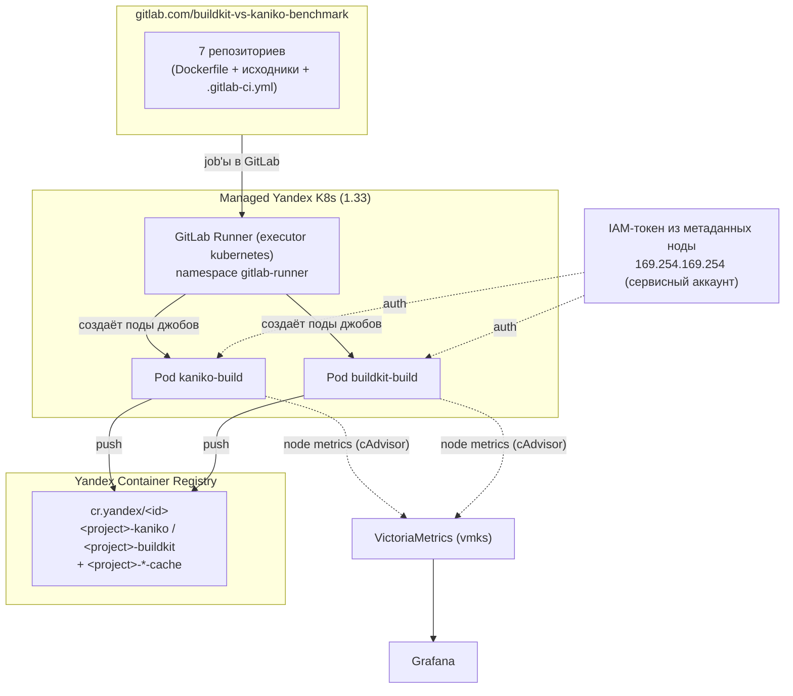

# Kaniko vs BuildKit в Managed Yandex K8s: что выбрать для сборки образов

## Введение

В Kubernetes-кластере рано или поздно встаёт вопрос: **где собирать Docker/OCI-образы приложений?** Вариант «на своей машине разработчика» не масштабируется на команду. Вынос сборок на отдельную виртуальную машину решает эту проблему, но создаёт накладные расходы на обслуживание инфраструктуры и лишает ключевых преимуществ k8s: отдельная ВМ не масштабируется горизонтально под нагрузку, параллельные джобы конкурируют за общие CPU, RAM и диск, а накапливающийся кэш требует регулярной очистки.

Kubernetes executor с использованием **Kaniko** и **BuildKit** лишен этих недостатков: сборка происходит в изолированных подах прямо на нодах кластера, ресурсы динамически масштабируются, а виртуальные машины для Docker-демона больше не требуются.

Классических ответов два — **Kaniko** и **BuildKit**:

- **Kaniko** ([GoogleContainerTools/kaniko](https://github.com/GoogleContainerTools/kaniko)) — инструмент от Google для сборки без privileged-контейнера. С июня 2025 года репозиторий архивирован и проект больше не развивается.
- **BuildKit** ([moby/buildkit](https://github.com/moby/buildkit)) — стандартный движок `docker build`, работающий в k8s в daemonless и rootless-режиме без привилегий ноды.

В этой статье будет протестировано **7 проектов** разных языков и фреймворков собираются обоими инструментами в одних и тех же условиях, с замером времени, потребления CPU/RAM и поведения кэша. В конце — **итоговая сводная таблица** и разбор **преимуществ и недостатков** каждого подхода для продакшна.

## Концепция

- **7 проектов** — отдельные репозитории группы [gitlab.com/buildkit-vs-kaniko-benchmark](https://gitlab.com/buildkit-vs-kaniko-benchmark). В корне каждого лежат Dockerfile и исходники (контекст сборки).
- Каждый репозиторий содержит `.gitlab-ci.yml` с **двумя параллельными job'ами** — `kaniko-build` и `buildkit-build`.
- Сборки выполняет **GitLab Runner (Kubernetes executor)**, развёрнутый в этом же кластере (helm-чарт, каталог `gitlab-runner/`).
- Результаты собираются в **Grafana**: дашборд с тремя панелями для сравнения **BuildKit** и **Kaniko** (CPU, RAM и длительность build-контейнера) **по выбранному проекту** (переменная `$project`).

## Что измеряем

| Категория | Как измеряем |
|---|---|
| **Время сборки** | длительность job'а `kaniko-build` / `buildkit-build` в GitLab (страница пайплайна или API) |
| **Потребление CPU/RAM** | cAdvisor → VictoriaMetrics → дашборд Grafana «Kaniko vs BuildKit — по проектам» |

## Сравниваемые проекты

Бенчмарк собирает **7 проектов** — по одному на характерный «профиль сборки»:

| № | Проект | Язык/Framework | Профиль сборки | Репозиторий |
|---|---|---|---|---|
| 1 | **Flask + Gunicorn** | Python | `pip install` multi-stage | [`flask`](https://gitlab.com/buildkit-vs-kaniko-benchmark/flask) |
| 2 | **NestJS** | Node/TS | тяжёлый `npm ci` + декораторы, tsc | [`nestjs`](https://gitlab.com/buildkit-vs-kaniko-benchmark/nestjs) |
| 3 | **Next.js** | Node/React SSR | `npm ci` + сборка клиента | [`nextjs`](https://gitlab.com/buildkit-vs-kaniko-benchmark/nextjs) |
| 4 | **Nuxt 3** | Node/Vue SSR | `npm ci` + сборка клиента | [`nuxtjs`](https://gitlab.com/buildkit-vs-kaniko-benchmark/nuxtjs) |
| 5 | **Go HTTP-сервис** | Go | `go build` → статический бинарник (из scratch) | [`golang`](https://gitlab.com/buildkit-vs-kaniko-benchmark/golang) |
| 6 | **Android APK** | Java/Kotlin, Gradle | `assembleRelease`, тяжёлый Gradle/SDK | [`android`](https://gitlab.com/buildkit-vs-kaniko-benchmark/android) |
| 7 | **ML: PyTorch inference** | Python | `pip install torch` + скачивание ~1.3 ГБ весов в BUILD-стадии (public S3-бакет) | [`ml-pytorch`](https://gitlab.com/buildkit-vs-kaniko-benchmark/ml-pytorch) |

## Архитектура стенда



Terraform поднимает:

Yandex Container Registry + IAM-привязку для сервисного аккаунта кластера (`container-registry.images.pusher` / `container-registry.images.puller`).

## Развёртывание

Перед развертыванием gitlab runner требуется чтобы у вас был создан Kubernetes кластер, S3 бакет и Container Registry.

В S3 бакет заливаем файл весов, например [pytorch_model](https://huggingface.co/google-bert/bert-large-uncased/resolve/main/pytorch_model.bin) для job `ml-pytorch`.


Для мониторинга устанавливаем VictoriaMetrics k8s-stack.

### 1a. Установка GitLab Runner

```bash
helm repo add gitlab-runner https://charts.gitlab.io/
helm repo update
helm upgrade --install gitlab-runner gitlab-runner/gitlab-runner \
  --version 0.92.1 \
  --namespace gitlab-runner \
  --create-namespace \
  --values gitlab-runner/values.yaml \
  --set-string "runnerToken=<runner-token>" \
  --timeout 10m
```

`<runner-token>` — токен раннера: взять в группе
`gitlab.com/buildkit-vs-kaniko-benchmark` → **Build → Runners → New group runner**
(или Settings → CI/CD → Runners). Токен в репозиторий не коммитится.

Команда ставит helm-чарт `gitlab-runner` (executor kubernetes) в namespace
`gitlab-runner`. Конфигурация — в `gitlab-runner/values.yaml`. Подробнее —
`gitlab-runner/README.md`.

### 2. Настройка переменных GitLab CI

В группе `gitlab.com/buildkit-vs-kaniko-benchmark` → **Settings → CI/CD →
Variables** задать:

| Переменная | Значение |
|---|---|
| `YCR_REGISTRY_ID` | `terraform output -raw registry_id; echo` (id registry, `cr...`) |

Переменная `YCR_REGISTRY` (адрес registry) задана по умолчанию в `.gitlab-ci.yml`
как `cr.yandex` — её можно переопределить при необходимости.

Секретов хранить не нужно: auth выполняется IAM-токеном из метаданных ноды.

### 3. Настройка GitLab Runner для push в Yandex Container Registry

Для авторизации и пуша собранных образов в YCR не используются статические токены, пароли или секреты, сохранённые в репозитории:

1. **Сервисный аккаунт нод кластера (`node_service_account`):**
   При развёртывании инфраструктуры через Terraform сервисному аккаунту нод кластера (`sa_k8s_editor`) назначаются роли `container-registry.images.pusher` и `container-registry.images.puller` на созданный реестр (см. `registry.tf`). Поды GitLab Runner запускаются на этих нодах и имеют сетевой доступ к сервису метаданных инстанса.
2. **Получение короткоживущего IAM-токена из метаданных ноды:**
   В секции `before_script` каждого CI-джоба выполняется запрос к сервису метаданных ноды по адресу `169.254.169.254` (интерфейс метаданных Google Compute Engine):
   ```bash
   TOKEN=$(wget -q -O - --header="Metadata-Flavor: Google" \
     "http://169.254.169.254/computeMetadata/v1/instance/service-accounts/default/token" \
     | sed -n 's/.*"access_token":"\([^"]*\)".*/\1/p')
   ```
   Токен генерируется платформой Yandex Cloud на базе привязанного к ноде сервисного аккаунта, действует ~12 часов и обновляется платформой автоматически.
3. **Формирование конфигурации Docker (`config.json`):**
   Для аутентификации в реестре `cr.yandex` формируется заголовок с пользователем `iam` и полученным токеном в качестве пароля:
   ```bash
   AUTH=$(printf "iam:%s" "$TOKEN" | base64 | tr -d '\n')
   # Для Kaniko (/kaniko/.docker/config.json):
   mkdir -p /kaniko/.docker
   echo "{\"auths\":{\"$YCR_REGISTRY\":{\"auth\":\"$AUTH\"}}}" > /kaniko/.docker/config.json

   # Для BuildKit (~/.docker/config.json):
   mkdir -p ~/.docker
   echo "{\"auths\":{\"$YCR_REGISTRY\":{\"auth\":\"$AUTH\"}}}" > ~/.docker/config.json
   ```
   Утилиты сборки (Kaniko и BuildKit) прозрачно считывают этот конфигурационный файл и аутентифицируются в реестре без необходимости хранить постоянные учетные данные.

### 4. Перенос проектов в репозитории

Каждый из 7 проектов — отдельный репозиторий группы. Содержимое (Dockerfile +
исходники + `.gitlab-ci.yml`) кладётся в корень main-ветки соответствующего
репозитория. Имена репозиториев: `android`, `flask`, `golang`, `ml-pytorch`,
`nestjs`, `nextjs`, `nuxtjs`.

Эталонный `.gitlab-ci.yml` (одинаков для всех 7 проектов; `$CI_PROJECT_NAME`
автоматически подставляет имя репозитория):

```yaml
variables:
  # cr.yandex — верный хост Yandex Container Registry
  # (registry.yandex.cloud не существует в DNS).
  YCR_REGISTRY: cr.yandex

stages:
  - build

before_script: &docker-auth
  # Короткоживущий IAM-токен из метаданных ноды -> docker config для push/pull.
  - mkdir -p "$DOCKER_CONFIG"
  - TOKEN=$(wget -q -O - --header="Metadata-Flavor: Google" "http://169.254.169.254/computeMetadata/v1/instance/service-accounts/default/token" | sed -n 's/.*"access_token":"\([^"]*\)".*/\1/p')
  - AUTH_B64=$(printf 'iam:%s' "$TOKEN" | base64 | tr -d '\n')
  - printf '{"auths":{"%s":{"auth":"%s"}}}' "$YCR_REGISTRY" "$AUTH_B64" > "$DOCKER_CONFIG/config.json"

kaniko-build:
  stage: build
  image: gcr.io/kaniko-project/executor:v1.23.2-debug
  variables:
    DOCKER_CONFIG: /kaniko/.docker
  script:
    - /kaniko/executor
        --dockerfile=Dockerfile
        --context=dir://$CI_PROJECT_DIR
        --destination="$YCR_REGISTRY/$YCR_REGISTRY_ID/$CI_PROJECT_NAME-kaniko:latest"
        --cache=true
        --cache-repo="$YCR_REGISTRY/$YCR_REGISTRY_ID/$CI_PROJECT_NAME-kaniko-cache"

buildkit-build:
  stage: build
  image: moby/buildkit:v0.32.2-rootless
  variables:
    DOCKER_CONFIG: /home/user/.docker
    XDG_RUNTIME_DIR: /tmp/buildkit
    BUILDKITD_FLAGS: --oci-worker-no-process-sandbox
  script:
    - buildctl-daemonless.sh build
        --frontend dockerfile.v0
        --local "context=$CI_PROJECT_DIR"
        --local "dockerfile=$CI_PROJECT_DIR"
        --output "type=image,name=$YCR_REGISTRY/$YCR_REGISTRY_ID/$CI_PROJECT_NAME-buildkit:latest,push=true"
        --import-cache "type=registry,ref=$YCR_REGISTRY/$YCR_REGISTRY_ID/$CI_PROJECT_NAME-buildkit-cache"
        --export-cache "type=registry,ref=$YCR_REGISTRY/$YCR_REGISTRY_ID/$CI_PROJECT_NAME-buildkit-cache,mode=max"
```

Ослабленный securityContext для rootless BuildKit (`seccompProfile: Unconfined`,
`appArmorProfile: Unconfined`) задаётся на уровне раннера в
`gitlab-runner/values.yaml` (`build_container_security_context`) — в
`.gitlab-ci.yml` его прописывать не нужно.

### 5. Запуск прогона

Запустите пайплайн в любом репозитории (Push → Pipeline). Пара
`kaniko+buildkit` выполняется параллельно. Между проектами — независимые
пайплайны (можно запускать все 7 параллельно).

Длительность сборки каждого инструмента — это длительность соответствующего
job'а в GitLab (страница пайплайна или GitLab API).

### 6. Дашборд в Grafana

Откройте дашборд **«Kaniko vs BuildKit — по проектам»**
(`UID: kaniko-vs-buildkit-project`) и выберите проект в переменной `$project`:
панели для сравнения **BuildKit** и **Kaniko** (CPU rate, memory working set и
растущее время сборки build-контейнеров) этого проекта. Проект различается по
GitLab project ID внутри имени пода джоба
(`runner-…-project-<ID>-concurrent-…`), инструмент — по label `image` метрик
cAdvisor. Файл `dashboards/kaniko-vs-buildkit-per-project.json` — импортируйте
его в Grafana вручную (Grafana → Dashboards → Import → Upload JSON), либо
применяется через ConfigMap-подход автоматически (см. `dashboards/README.md`).

## Ожидаемые результаты

Таблица заполняется после реального прогона (см. «Как заполнить результаты» ниже). Ожидания из практики:

| Метрика | Kaniko | BuildKit |
|---|---|---|
| Время сборки **без кэша** (полный `apt install` + pip) | ~3–5 мин | ~1.5–3 мин (параллельные шаги) |
| Время сборки **с кэшем** (повторный прогон) | быстрее через `--cache` (registry-кэш): слой берётся из registry без пересборки | registry-кэш через `--import-cache`/`--export-cache type=registry`, push только новых слоёв |
| CPU (max) | монотонно по слоям | многопоточный (несколько воркеров за раз) |
| RAM (max) | выше из-за полного `apt`/pip в процессе | зависит от параллелизма |
| Итоговый образ | OCI | OCI |

> Это **ожидания**, а не результат. Ниже методика, как получить числа на вашем стенде, и таблицы для заполнения.

## Как заполнить сводную таблицу результатов

1. Запустите пайплайн в каждом из 7 репозиториев (первый прогон — холодный кэш).
2. Зафиксируйте длительность job'ов `kaniko-build` и `buildkit-build` (страница
   пайплайна в GitLab или API `GET /projects/:id/pipelines/:pipeline_id/jobs`).
3. Запустите повторный прогон (тёплый кэш) тем же способом — запишите вторые числа.
4. Снимите CPU/RAM с дашборда Grafana за соответствующий интервал.
5. Внесите числа в таблицу ниже и сформулируйте вывод.

### Итоговая сводная таблица (7 проектов)

Заполняется после реального прогона. Пример формата:

| Проект | Время kaniko (с) | Время buildkit (с) | Выигрыш BuildKit % |
|---|---|---|---|
| flask | _заполнить_ | _заполнить_ | _заполнить_ |
| nestjs | _заполнить_ | _заполнить_ | _заполнить_ |
| nextjs | _заполнить_ | _заполнить_ | _заполнить_ |
| nuxtjs | _заполнить_ | _заполнить_ | _заполнить_ |
| golang | _заполнить_ | _заполнить_ | _заполнить_ |
| android | _заполнить_ | _заполнить_ | _заполнить_ |
| ml-pytorch | _заполнить_ | _заполнить_ | _заполнить_ |

### Детализация по метрикам (пример на проекте golang)

#### Прогон 1: холодный кэш

| Метрика | Kaniko | BuildKit |
|---|---|---|
| Время сборки (сек) | _заполнить_ | _заполнить_ |
| Пиковый CPU (rate, cores) | _заполнить_ | _заполнить_ |
| Пиковая RAM (working set, GiB) | _заполнить_ | _заполнить_ |
| Ошибки/retries | _заполнить_ | _заполнить_ |

#### Прогон 2: тёплый кэш

| Метрика | Kaniko | BuildKit |
|---|---|---|
| Время сборки (сек) | _заполнить_ | _заполнить_ |
| Пиковый CPU (rate, cores) | _заполнить_ | _заполнить_ |
| Пиковая RAM (working set, GiB) | _заполнить_ | _заполнить_ |
| Ошибки/retries | _заполнить_ | _заполнить_ |

## Преимущества и недостатки

### ВМ с Docker

**Преимущества:**

- **Полноценный `docker build`.** Никаких ограничений managed-кластера: доступен privileged, демон Docker, `docker buildx`, любые флаги и синтаксис.
- **Накопление кэша.** Слои и кэш сборки живут на диске ВМ между прогонами — инкрементальные пересборки максимально быстрые.
- **Просто для команд с legacy.** Если сборка уже «работает на сервере с Docker», перенос на ВМ ничего не ломает.

**Недостатки:**

- **Отдельная инфраструктура.** ВМ нужно создавать, настраивать, обновлять и патчить; появляется ещё один компонент, который надо мониторить и бэкапить.
- **Безопасность и сеть.** ВМ должна быть доступна CI-джобам (публичный IP или приватная сеть + NAT), а `docker.sock`/Docker Remote API — источник эскалации до root на ноде; требует защиты (TLS, аутентификация, ограничение доступа).
- **Масштабируемость.** Одна ВМ с Docker — узкое место: параллельные сборки делят её CPU/RAM/диск, горизонтально масштабировать сложнее, чем поды в кластере.
- **Сборка «в стороне» от кластера.** Образ всё равно пушится в registry и заливается в K8s — появляется лишний hop и задержка.

### Kaniko

**Преимущества:**

- **Работает без привилегий.** Обычный контейнер без privileged, никакого docker.sock — подходит для managed-кластера и строгих политик безопасности.
- **Простота.** Один бинарник-джоб хорошо известен, огромное количество документации и примеров.
- **Кэш в registry.** `--cache-repo` позволяет переиспользовать слои между сборками непротиворечиво, даже если сам кластер/нода меняются (кэш живёт в registry, а не на диске пода).
- **Можно собирать в любом кластере** — без настройки daemon, без sysctl, без user-namespace.

**Недостатки:**

- **Скорость.** Сборка идёт последовательно по слоям (несколько слоёв параллельно не строятся), что на тяжёлых Dockerfile заметно медленнее BuildKit.
- **Слабое кэширование на диске.** По умолчанию кэш пишется в registry (медленнее и дороже), локального кэша между прогонами нет.
- **Ограниченный синтаксис.** Не поддерживает продвинутые фичи BuildKit: `RUN --mount=type=cache`, `RUN --mount=type=secret`, `--mount=type=ssh` и т.п. (часть поддерживается через флаги, но не вся).
- **Контекст и большие слои.** Kaniko должен скачивать и разворачивать базовый образ и предыдущие слои целиком; при большом контексте это занимает время и место.

### BuildKit

**Преимущества:**

- **Скорость.** Многопоточная сборка (параллельные шаги), кэш слоёв и быстрый инкрементальный пересбор. На реальных Dockerfile часто в 2–3 раза быстрее Kaniko.
- **Родная поддержка кэша.** `buildkitd` умеет хранить кэш локально и поддерживает внешние кэши (registry, S3). В этом бенчмарке локальный кэш не используется — BuildKit работает с registry-кэшем через `--import-cache`/`--export-cache type=registry` (аналог `--cache-repo` Kaniko).
- **Богатый синтаксис.** `RUN --mount=type=cache|secret|ssh`, `RUN --mount=type=bind`, BuildKit-составные шаги, возможность подключать внешние кэши.
- **Та же технология, что у `docker build`.** Что собирается в CI/local docker, то и BuildKit — единый синтаксис.

**Недостатки:**

- **Сложнее.** Daemonless-джоб поднимает встроенный демон, требует понимания `buildctl`/`buildkitd` и кэша.
- **Ресурсы.** Многопоточность = большее пиковое потребление CPU/RAM, которое нужно учитывать в requests/limits.
- **Оба кэша эфемерны.** В этом бенчмарке ни Kaniko, ни BuildKit не хранят локальный кэш между прогонами (Kaniko не пишет кэш на диск по умолчанию, BuildKit живёт в daemonless-поде без PVC) — теплота кэша обеспечивается только registry-кэшем. Kaniko-кэш в `--cache-repo` и BuildKit-кэш в `--export-cache type=registry` в равной степени переживают пересоздание подов.
- **Rootless-режим имеет нюансы.** В этом бенчмарке BuildKit работает rootless (как и Kaniko — без privileged), поэтому нужны unprivileged user namespaces на нодах, `oci-worker-no-process-sandbox` и ослабленный seccomp/apparmor (`Unconfined`) на build-контейнере. Если ноды не дают user namespaces — см. DaemonSet-воркараунд из `examples/kubernetes/sysctl-userns.privileged.yaml` в moby/buildkit.

## Вывод

Kaniko — «заниженный порог входа» для безопасной сборки без привилегий (без privileged); подходит, когда нужно просто и надёжно собрать типовой образ в managed-кластере. BuildKit — значительный прирост скорости и выразительности Dockerfile ценой сложности daemonless-настройки и большего потребления ресурсов. В этом бенчмарке оба инструмента работают **без privileged** в одинаковых условиях, поэтому разница сводится к скорости и кэшированию.

Итоговую рекомендацию нужно давать по числам из сводной таблицы: если сборка редкая и Dockerfile типовой, Kaniko достаточно; если собираете часто, образы тяжёлые (Node/Gradle/ML) и хочется скорости — BuildKit, но с правильной конфигурацией кэша и ресурсов.

## Очистка registry (перед `terraform destroy`)

Скрипт `scripts/delete-registry-images.sh` удаляет все образы (и, опционально,
репозитории) из Yandex Container Registry через REST API — без CLI `yc`.
Аутентификация — через IAM-токен:

```bash
export YC_TOKEN=$(yc iam create-token)
./scripts/delete-registry-images.sh $(terraform output -raw registry_id) --with-repositories
```

Флаг `--with-repositories` дополнительно удаляет пустые репозитории реестра
(иначе `terraform destroy` может упасть на непустом registry). После очистки
можно выполнять `terraform destroy`.
