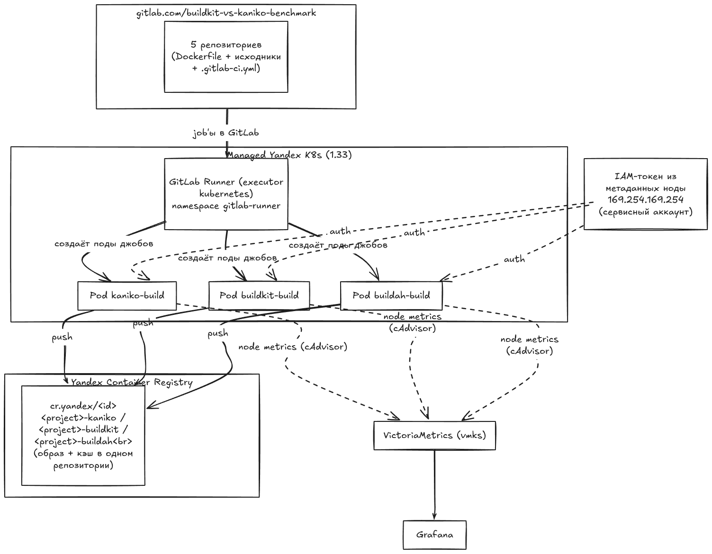

# Kaniko vs BuildKit vs Buildah: замеряем время, CPU и память сборки в кластере

## Введение

В Kubernetes-кластере рано или поздно встаёт вопрос: **где собирать Docker image приложений?** Вариант «на своей машине разработчика» не масштабируется на команду. Вынос сборок на отдельную виртуальную машину решает эту проблему, но создаёт накладные расходы на обслуживание инфраструктуры и лишает ключевых преимуществ k8s: отдельная ВМ не масштабируется горизонтально под нагрузку, параллельные джобы конкурируют за общие CPU, RAM и диск, а накапливающийся кэш требует регулярной очистки.

Kubernetes executor с **Kaniko**, **BuildKit** или **Buildah** лишён этих недостатков: сборка происходит в изолированных подах прямо на нодах кластера, ресурсы динамически масштабируются, а виртуальные машины для Docker-демона больше не требуются.

- **Kaniko** ([GoogleContainerTools/kaniko](https://github.com/GoogleContainerTools/kaniko)) — инструмент от Google для сборки без privileged-контейнера. С июня 2025 года репозиторий архивирован и проект больше не развивается.
- **BuildKit** ([moby/buildkit](https://github.com/moby/buildkit)) — стандартный движок `docker build`, работающий в k8s в daemonless и rootless-режиме без привилегий ноды.
- **Buildah** ([containers/buildah](https://github.com/podman-container-tools/buildah)) — daemonless-сборка OCI-образов (`buildah bud`) без Docker-демона. В этом стенде — образ `quay.io/buildah/stable:v1.43.2`, rootless `bud` с `--layers` и registry-кэшем (`--cache-from` / `--cache-to`).

**DinD не используется.** Docker-in-Docker требует `privileged = true`. В GitLab Runner (kubernetes executor) флаг `privileged` задаётся на уровне раннера, а не джоба: для DinD пришлось бы заводить **отдельный** GitLab Runner с `privileged = true` и другим тегом. Текущий раннер `k8s-benchmark` держит `privileged = false` — иначе условия замеров Kaniko / BuildKit / Buildah ломаются. Стенд выбран как раз ради сборки без привилегий.

В этой статье будет протестировано **5 проектов** разных языков и фреймворков, которые собираются тремя инструментами в одних и тех же условиях, с замером времени, потребления CPU/RAM и поведения кэша. В конце — **итоговая сводная таблица** и разбор **преимуществ и недостатков** каждого подхода для продакшна.

**Кэш.** Все три инструмента используют только registry-кэш. Локальный кэш на ноде намеренно не используется — он копится на диске и требует очистки. Registry-кэш чистить не нужно: манифест кэша перезаписывается на каждом прогоне, а мусор подчищает garbage collection реестра. Хранясь вне пода, он переживает пересоздание и смену ноды.

**Android.** APK **не закатывается в image** и **не загружается в registry**: после `assembleRelease` в Dockerfile выполняется `RUN rm` APK, финальный image не пушится (`--no-push` / `push=false` / без `--push`). Registry-кэш слоёв при этом остаётся. Замеряем только **build**, не скорость загрузки APK в registry.

## Сравниваемые проекты

Бенчмарк собирает **5 проектов** — по одному на характерный «профиль сборки»:

| № | Проект | Язык/Framework | Профиль сборки | Репозиторий |
|---|---|---|---|---|
| 1 | **Next.js** | Node/React SSR | `npm ci` + сборка клиента | [`nextjs`](https://gitlab.com/buildkit-vs-kaniko-benchmark/nextjs) |
| 2 | **Nuxt 3** | Node/Vue SSR | `npm ci` + сборка клиента | [`nuxtjs`](https://gitlab.com/buildkit-vs-kaniko-benchmark/nuxtjs) |
| 3 | **Go HTTP-сервис** | Go | `go build` → статический бинарник (из scratch) | [`golang`](https://gitlab.com/buildkit-vs-kaniko-benchmark/golang) |
| 4 | **Android APK** | Java/Kotlin, Gradle | `assembleRelease`, тяжёлый Gradle/SDK; APK удаляется, image не пушится | [`android`](https://gitlab.com/buildkit-vs-kaniko-benchmark/android) |
| 5 | **ML: PyTorch inference** | Python | `pip install torch` + скачивание ~1.3 ГБ весов в BUILD-стадии (public S3-бакет) | [`ml-pytorch`](https://gitlab.com/buildkit-vs-kaniko-benchmark/ml-pytorch) |

**Слои без privileged.** Kaniko не монтирует overlay: распаковывает базовый образ в свой root и после каждой инструкции Dockerfile делает snapshot обходом файловой системы в userspace. BuildKit в rootless на ядре Ubuntu 5.15 складывает слои overlay в user namespace (RootlessKit) — `/dev/fuse` не нужен. Buildah собирает образ как контейнер: слои надо смонтировать в одно дерево. Kernel overlay в unprivileged-поде без `CAP_SYS_ADMIN` недоступен, fallback — fuse-overlayfs, для которого нужен `/dev/fuse`. В поде раннера этого устройства нет, поэтому rootless Buildah падает с `fuse: device /dev/fuse not found`. Без privileged остаются: смонтировать `/dev/fuse` в build-контейнер или storage-драйвер `vfs` (копирование слоёв без mount). В этом стенде у Buildah задан `STORAGE_DRIVER=vfs`.

## Архитектура стенда



## Развёртывание

Перед развертыванием gitlab runner требуется чтобы у вас был создан Kubernetes кластер, S3 бакет и Container Registry.

В S3 бакет заливаем файл весов, например [pytorch_model](https://huggingface.co/google-bert/bert-large-uncased/resolve/main/pytorch_model.bin) для job `ml-pytorch`.


Для мониторинга устанавливаем VictoriaMetrics k8s-stack.

### 1a. Установка GitLab Runner

Устанавливаем GitLab Runner с такой конфигурацией `values.yaml`:

```yaml
gitlabUrl: https://gitlab.com/

# Количество параллельно выполняемых джобов. Тройка kaniko+buildkit+buildah
# одного проекта запускается одновременно (3 джоба), поэтому 3 достаточно.
concurrent: 3

# RBAC для создания/управления подами джобов.
rbac:
  create: true
  rules: []

serviceAccount:
  create: true

runners:
  executor: kubernetes
  # Тег, по которому джобы в .gitlab-ci.yml выбирают этот раннер.
  tags: "k8s-benchmark"
  # Раннер принимает только джобы с указанным тегом.
  runUntagged: false
  # Глобальный конфиг executor'а. Задаём лимиты build-контейнера
  # (те же 4 CPU / 4 GiB, что были у старых K8s-джобов бенчмарка).
  config: |
    [[runners]]
      request_concurrency = 3
      [runners.kubernetes]
        namespace = "{{ .Release.Namespace }}"
        image = "alpine:3.20"
        cpu_request = "1"
        cpu_limit = "4"
        memory_request = "1Gi"
        memory_limit = "12Gi"
        helper_cpu_request = "100m"
        helper_cpu_limit = "500m"
        helper_memory_request = "128Mi"
        helper_memory_limit = "512Mi"
        # Build-контейнер работает без privileged (условия замеров уравнены
        # с прежним стендом). BuildKit в rootless-режиме требует ослабленный
        # securityContext: seccomp/apparmor Unconfined (нужен unshare mount ns).
        privileged = false
        allow_privilege_escalation = false
        [runners.kubernetes.build_container_security_context]
          [runners.kubernetes.build_container_security_context.seccomp_profile]
            type = "Unconfined"
          [runners.kubernetes.build_container_security_context.app_armor_profile]
            type = "Unconfined"
        # Имена подов джобов важны для Grafana: GitLab Runner включает в них
        # GitLab project ID (runner-…-project-<ID>-concurrent-…), по которому
        # дашборд различает проекты, а инструменты различаются по label `image`
        # метрик cAdvisor (…/kaniko… vs …/buildkit… vs …/buildah…).
        pull_policy = "if-not-present"

resources:
  requests:
    cpu: 100m
    memory: 128Mi
  limits:
    cpu: 500m
    memory: 512Mi
```

### 2. Настройка переменных GitLab CI

В группе `gitlab.com/buildkit-vs-kaniko-benchmark` → **Settings → CI/CD →
Variables** задать необходимо задать YCR_REGISTRY_ID.

### 3. Настройка GitLab Runner для push в Yandex Container Registry

Для авторизации и пуша собранных образов в YCR не используются статические токены, пароли или секреты, сохранённые в репозитории:

1. **Сервисный аккаунт нод кластера (`node_service_account`):**
   При развёртывании инфраструктуры через Terraform сервисному аккаунту нод кластера (`sa_k8s_node`) назначаются роли `container-registry.images.pusher` и `container-registry.images.puller` на созданный реестр (см. `registry.tf`). Поды GitLab Runner запускаются на этих нодах и имеют сетевой доступ к сервису метаданных инстанса.
2. **Получение короткоживущего IAM-токена из метаданных ноды:**
   В секции `before_script` каждого CI-джоба выполняется запрос к сервису метаданных ноды по адресу `169.254.169.254` (интерфейс метаданных Google Compute Engine):
   ```bash
   TOKEN=$(wget -q -O - --header="Metadata-Flavor: Google" \
     "http://169.254.169.254/computeMetadata/v1/instance/service-accounts/default/token" \
     | sed -n 's/.*"access_token":"\([^"]*\)".*/\1/p')
   ```
   Токен генерируется платформой Yandex Cloud на базе привязанного к ноде сервисного аккаунта, действует ~12 часов и обновляется платформой автоматически.
3. **Формирование конфигурации Docker (`config.json`):**
   Для аутентификации в реестре `cr.yandex` формируется заголовок с пользователем `iam` и полученным токеном в качестве пароля:
   ```bash
   AUTH=$(printf "iam:%s" "$TOKEN" | base64 | tr -d '\n')
   # Для Kaniko (/kaniko/.docker/config.json):
   mkdir -p /kaniko/.docker
   echo "{\"auths\":{\"$YCR_REGISTRY\":{\"auth\":\"$AUTH\"}}}" > /kaniko/.docker/config.json

   # Для BuildKit (~/.docker/config.json):
   mkdir -p ~/.docker
   echo "{\"auths\":{\"$YCR_REGISTRY\":{\"auth\":\"$AUTH\"}}}" > ~/.docker/config.json

   # Для Buildah (/home/build/.docker/config.json):
   mkdir -p /home/build/.docker
   echo "{\"auths\":{\"$YCR_REGISTRY\":{\"auth\":\"$AUTH\"}}}" > /home/build/.docker/config.json
   ```
   Утилиты сборки (Kaniko, BuildKit и Buildah) прозрачно считывают этот конфигурационный файл и аутентифицируются в реестре без необходимости хранить постоянные учетные данные. В образе Buildah нет `wget` — IAM-токен там берётся через `curl`.

### 4. Перенос проектов в репозитории

Эталонный `.gitlab-ci.yml` (одинаков для nextjs / nuxtjs / golang / ml-pytorch;
`$CI_PROJECT_NAME` автоматически подставляет имя репозитория). У **android**
тот же набор джобов, но финальный image **не пушится** (см. ниже).

```yaml
variables:
  # cr.yandex — верный хост Yandex Container Registry
  # (registry.yandex.cloud не существует в DNS).
  YCR_REGISTRY: cr.yandex

stages:
  - build

before_script: &docker-auth
  # Короткоживущий IAM-токен из метаданных ноды -> docker config для push/pull.
  - mkdir -p "$DOCKER_CONFIG"
  - TOKEN=$(wget -q -O - --header="Metadata-Flavor: Google" "http://169.254.169.254/computeMetadata/v1/instance/service-accounts/default/token" | sed -n 's/.*"access_token":"\([^"]*\)".*/\1/p')
  - AUTH_B64=$(printf 'iam:%s' "$TOKEN" | base64 | tr -d '\n')
  - printf '{"auths":{"%s":{"auth":"%s"}}}' "$YCR_REGISTRY" "$AUTH_B64" > "$DOCKER_CONFIG/config.json"

kaniko-build:
  stage: build
  image: gcr.io/kaniko-project/executor:v1.23.2-debug
  variables:
    DOCKER_CONFIG: /kaniko/.docker
  script:
    - /kaniko/executor
        --dockerfile=Dockerfile
        --context=dir://$CI_PROJECT_DIR
        --destination="$YCR_REGISTRY/$YCR_REGISTRY_ID/$CI_PROJECT_NAME-kaniko:latest"
        --cache=true
        --cache-repo="$YCR_REGISTRY/$YCR_REGISTRY_ID/$CI_PROJECT_NAME-kaniko"

buildkit-build:
  stage: build
  image: moby/buildkit:v0.32.2-rootless
  variables:
    DOCKER_CONFIG: /home/user/.docker
    XDG_RUNTIME_DIR: /tmp/buildkit
    BUILDKITD_FLAGS: --oci-worker-no-process-sandbox
  script:
    - buildctl-daemonless.sh build
        --frontend dockerfile.v0
        --local "context=$CI_PROJECT_DIR"
        --local "dockerfile=$CI_PROJECT_DIR"
        --output "type=image,name=$YCR_REGISTRY/$YCR_REGISTRY_ID/$CI_PROJECT_NAME-buildkit:latest,push=true"
        --import-cache "type=registry,ref=$YCR_REGISTRY/$YCR_REGISTRY_ID/$CI_PROJECT_NAME-buildkit"
        --export-cache "type=registry,ref=$YCR_REGISTRY/$YCR_REGISTRY_ID/$CI_PROJECT_NAME-buildkit,mode=max"

buildah-build:
  stage: build
  image: quay.io/buildah/stable:v1.43.2
  variables:
    DOCKER_CONFIG: /home/build/.docker
    REGISTRY_AUTH_FILE: /home/build/.docker/config.json
    BUILDAH_ISOLATION: chroot
    STORAGE_DRIVER: vfs
  before_script:
    - export HOME=/home/build
    - mkdir -p "$DOCKER_CONFIG"
    - TOKEN=$(curl -sS -H "Metadata-Flavor: Google" "http://169.254.169.254/computeMetadata/v1/instance/service-accounts/default/token" | sed -n 's/.*"access_token":"\([^"]*\)".*/\1/p')
    - AUTH_B64=$(printf 'iam:%s' "$TOKEN" | base64 | tr -d '\n')
    - printf '{"auths":{"%s":{"auth":"%s"}}}' "$YCR_REGISTRY" "$AUTH_B64" > "$DOCKER_CONFIG/config.json"
  script:
    - buildah bud --layers
        --cache-from "$YCR_REGISTRY/$YCR_REGISTRY_ID/$CI_PROJECT_NAME-buildah"
        --cache-to "$YCR_REGISTRY/$YCR_REGISTRY_ID/$CI_PROJECT_NAME-buildah"
        -t "$YCR_REGISTRY/$YCR_REGISTRY_ID/$CI_PROJECT_NAME-buildah:latest"
        .
    - buildah push "$YCR_REGISTRY/$YCR_REGISTRY_ID/$CI_PROJECT_NAME-buildah:latest"
```

`--layers` у Buildah обязателен: без него `--cache-from` / `--cache-to` игнорируются.

У **android** destination/push финального image отключается, registry-кэш слоёв остаётся:

- Kaniko: `--no-push`
- BuildKit: `push=false`
- Buildah: без `buildah push`

Ослабленный securityContext для rootless BuildKit (`seccompProfile: Unconfined`,
`appArmorProfile: Unconfined`) задаётся на уровне раннера в
`gitlab-runner/values.yaml` (`build_container_security_context`) — в
`.gitlab-ci.yml` его прописывать не нужно.

### 5. Дашборд в Grafana

Дашборд: [kaniko-vs-buildkit-per-project.json](https://github.com/patsevanton/buildkit-vs-kaniko-benchmark/blob/main/dashboards/kaniko-vs-buildkit-per-project.json) —
импортируйте в Grafana вручную (Dashboards → Import → Upload JSON).

### Скриншоты дашборда

Скриншоты сняты на **тёплом прогоне** (с прогретым registry-кэшем) — сравнение
Kaniko, BuildKit и Buildah в одинаковых условиях кэш-хита.

*Next.js — потребление CPU (Kaniko, BuildKit, Buildah), тёплый кэш.*


*Next.js — потребление памяти, тёплый кэш.*


*Nuxt 3 — потребление CPU (Kaniko, BuildKit, Buildah), тёплый кэш.*


*Nuxt 3 — потребление памяти, тёплый кэш.*


*Go HTTP-сервис — потребление CPU (Kaniko, BuildKit, Buildah), тёплый кэш.*


*Go HTTP-сервис — потребление памяти, тёплый кэш.*


*Android APK — потребление CPU (Kaniko, BuildKit, Buildah), тёплый кэш.*


*Android APK — потребление памяти, тёплый кэш.*


*ML: PyTorch inference — потребление CPU (Kaniko, BuildKit, Buildah), тёплый кэш.*


*ML: PyTorch inference — потребление памяти, тёплый кэш.*


### Итоговые сводные таблицы

Цифры ниже — **тёплый прогон** (с прогретым registry-кэшем) тройки
Kaniko / BuildKit / Buildah по всем пяти проектам. Время сборки = длительность
job в GitLab; CPU/RAM сняты cAdvisor'ом (VictoriaMetrics) с build-контейнеров
в namespace `gitlab-runner`.

#### Время сборки (тёплый кэш)

| Проект | Kaniko (с) | BuildKit (с) | Buildah (с) | Выигрыш BuildKit vs Kaniko % | Выигрыш BuildKit vs Buildah % |
|---|---|---|---|---|---|
| nextjs | 74 | 14 | 287 | 81 | 95 |
| nuxtjs | 52 | 14 | 192 | 73 | 93 |
| golang | 31 | 13 | 237 | 58 | 95 |
| android | 90 | 10 | 21 | 89 | 53 |
| ml-pytorch | 295 | 15 | 536 | 95 | 97 |

#### Время сборки (холодный кэш)

| Проект | Kaniko (с) | BuildKit (с) | Buildah (с) |
|---|---|---|---|
| nextjs | 118 | 145 | 360 |
| nuxtjs | 69 | 71 | 212 |
| golang | 57 | 62 | 282 |
| android | 213 | 12 | 28 |
| ml-pytorch | 451 | 310 | 770 |

#### CPU и RAM (тёплый кэш)

| Проект | CPU kaniko (cores) | CPU buildkit (cores) | CPU buildah (cores) | RAM kaniko | RAM buildkit | RAM buildah |
|---|---|---|---|---|---|---|
| nextjs | 0.47 | 0.01 | 0.26 | 2.03 GiB | 3.2 MiB | 5.30 GiB |
| nuxtjs | 0.36 | 0.02 | 0.28 | 912 MiB | 3.5 MiB | 4.00 GiB |
| golang | 0.23 | 0.01 | 0.25 | 124 MiB | 3.1 MiB | 4.19 GiB |
| android | 0.64 | 0.01 | 0.25 | 1.18 GiB | 3.5 MiB | 108 MiB |
| ml-pytorch | 0.64 | 0.01 | 0.26 | 10.88 GiB | 3.2 MiB | 5.56 GiB |

## Вывод

На **тёплом кэше** BuildKit почти обнуляет работу: ~**0.01 CPU** и **~3 MiB RAM**
(уровень простоя контейнера) на всех пяти проектах — слои берутся из registry,
локальной сборки нет. Отсюда и время: **10–15 с** независимо от профиля.

**Kaniko** на том же кэше продолжает разворачивать слои и жечь ресурсы:
CPU **0.23–0.64** cores, working set от **124 MiB** (golang) до **10.88 GiB**
(ml-pytorch), время — **31–295 с**. Выигрыш BuildKit по времени — **58–95 %**.

**Buildah** (rootless `bud --layers` c `--cache-from`/`--cache-to`, storage-драйвер
`vfs`) попадает в зависимость от профиля: на android — **21 с** (кэш слоёв
Gradle-сборки), на Node/ML — **192–536 с**, CPU **0.25–0.28** cores. Большой
working set (**4–5.6 GiB**) — следствие `vfs`: каждый слой копируется в отдельное
дерево вместо overlay-mount. На «тяжёлых» Node/ML-профилях Buildah заметно
проигрывает BuildKit и по времени (разрыв до **97 %**), и по памяти.

**Холодный кэш** уравнивает тройку: все качают слои и собирают с нуля. Здесь
разброс меньше, но BuildKit стабильно быстрее на профилях с большим числом слоёв
в кэше (android **12 с** против **213 с** у Kaniko — Gradle-слои переиспользуются
из кэша), а на ML всё упирается в скачивание ~1.3 ГБ весов (Kaniko **451 с**,
BuildKit **310 с**, Buildah **770 с**).

**Итог:** для сборки в кластере без privileged и с registry-кэшем BuildKit
выигрывает по всем осям — минимальные CPU/RAM и стабильно малое время на тёплом
кэше. Kaniko держит больший working set и дольше «додумывает» слои на кэш-хите.
Buildah с `vfs` — самый тяжёлый по памяти и сильно зависит от профиля сборки.
