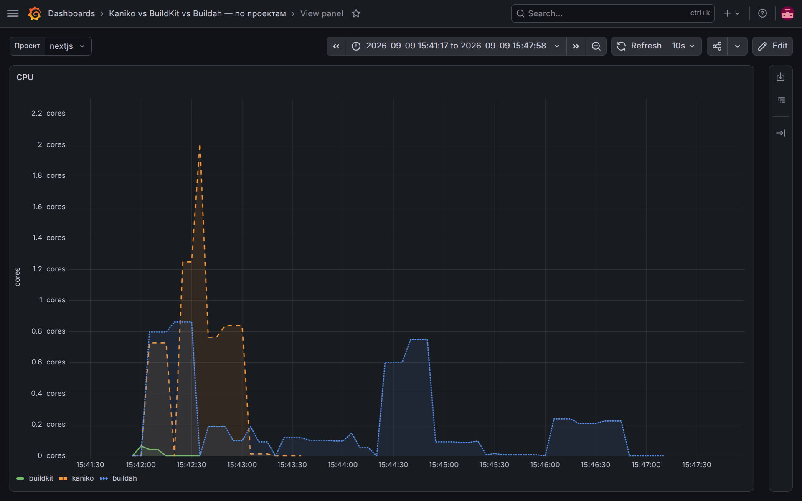
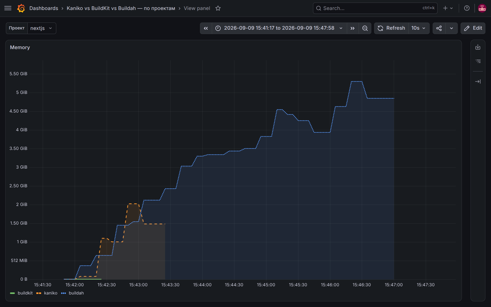
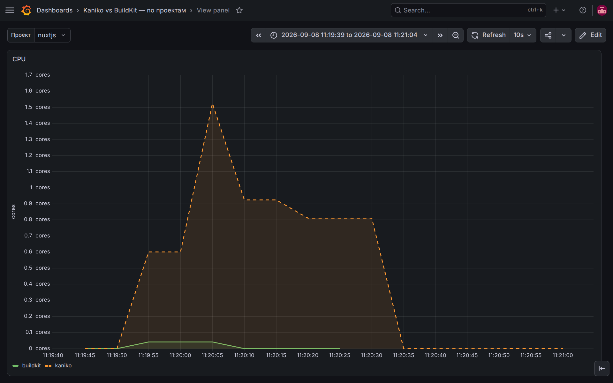
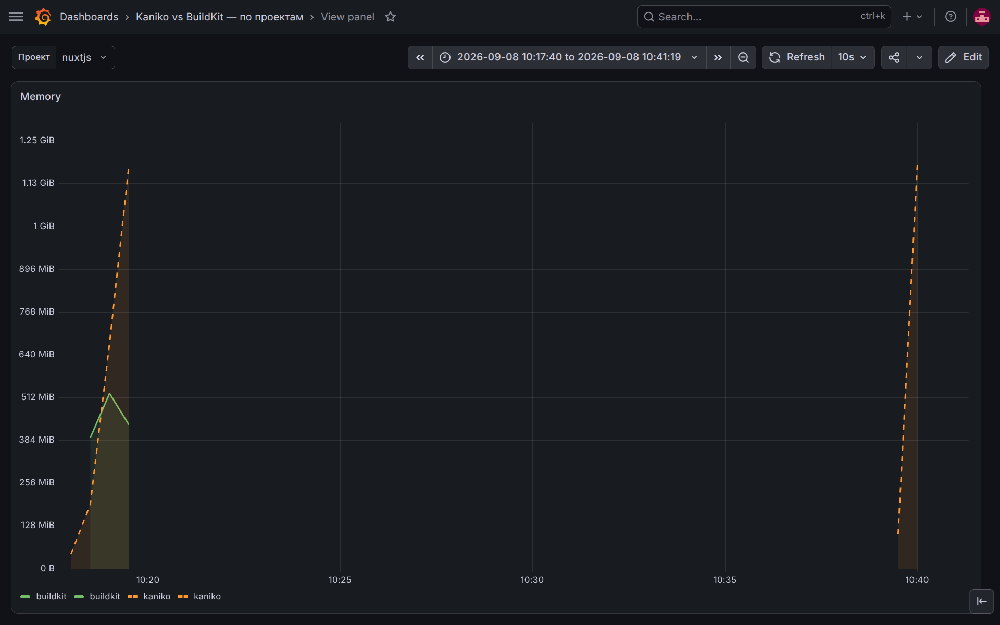
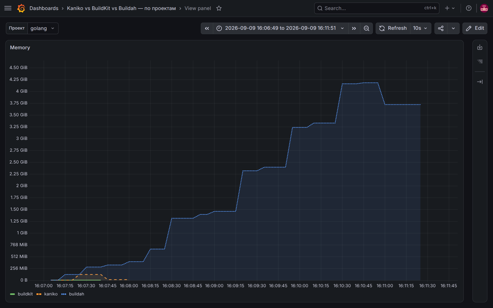
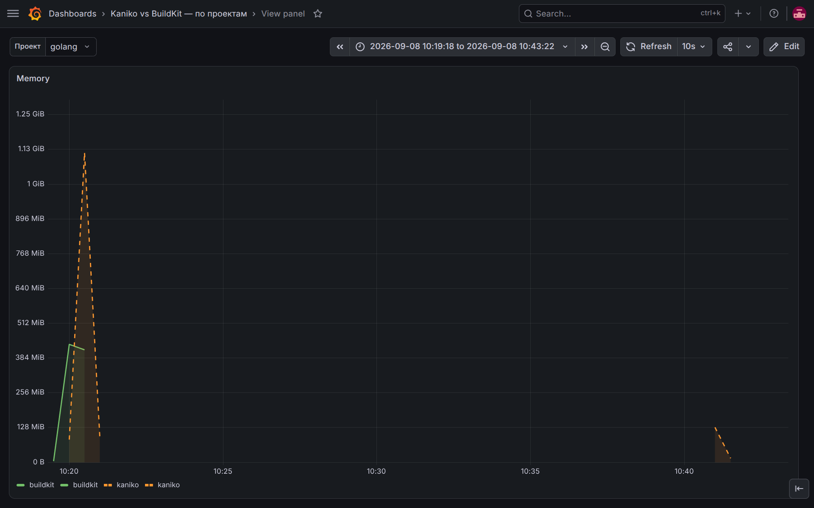
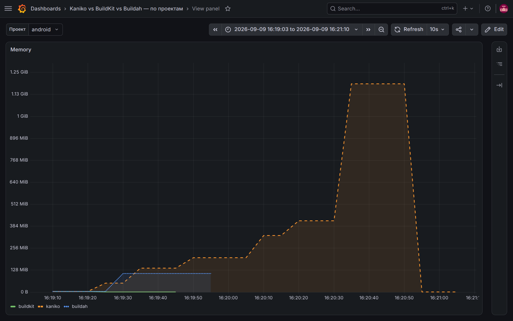
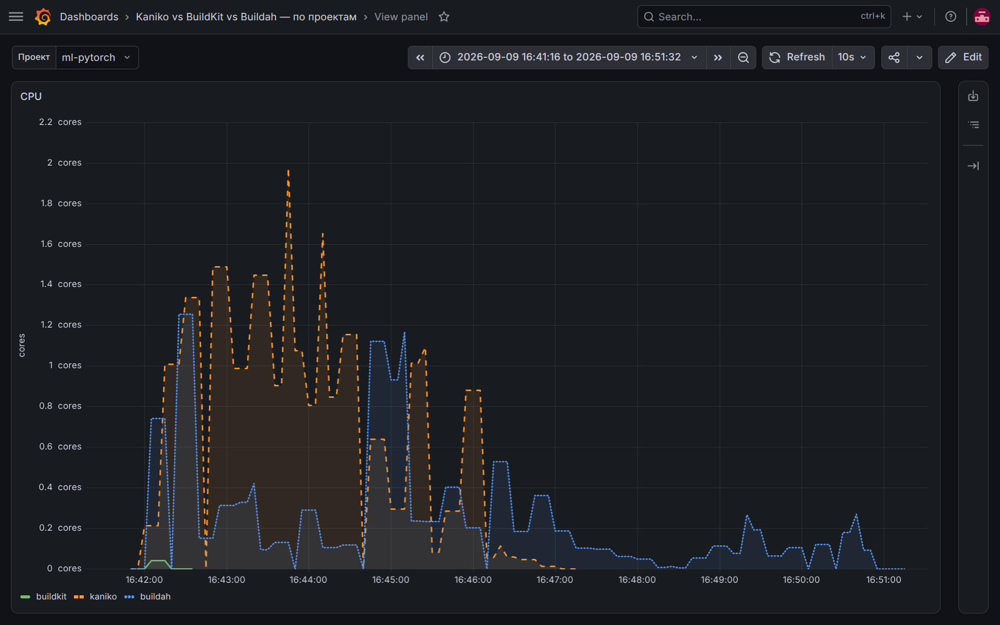
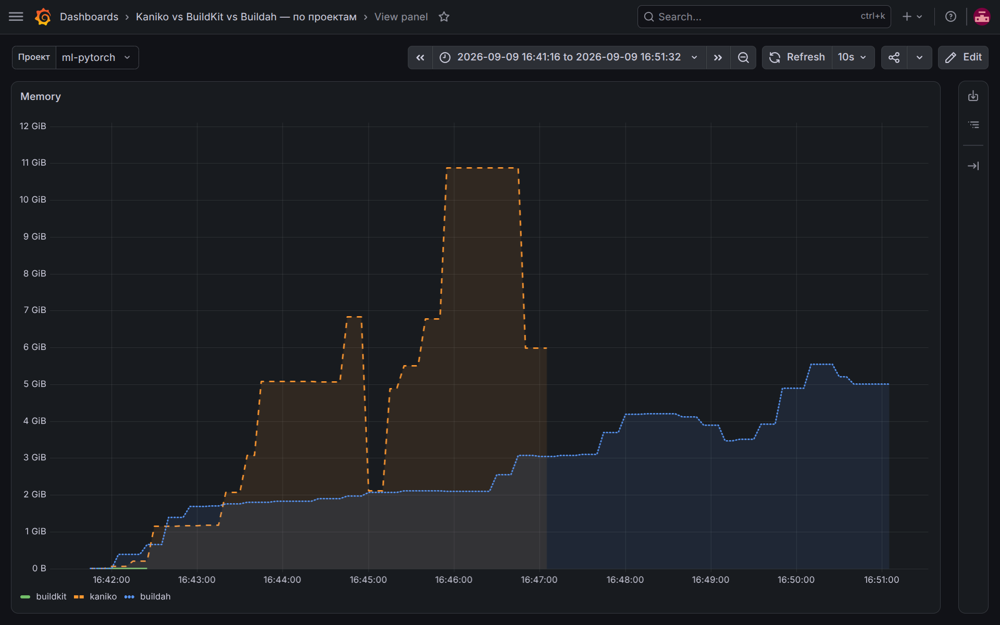

# Kaniko vs BuildKit в Managed Yandex K8s: что выбрать для сборки образов

## Введение

В Kubernetes-кластере рано или поздно встаёт вопрос: **где собирать Docker image приложений?** Вариант «на своей машине разработчика» не масштабируется на команду. Вынос сборок на отдельную виртуальную машину решает эту проблему, но создаёт накладные расходы на обслуживание инфраструктуры и лишает ключевых преимуществ k8s: отдельная ВМ не масштабируется горизонтально под нагрузку, параллельные джобы конкурируют за общие CPU, RAM и диск, а накапливающийся кэш требует регулярной очистки.

Классических ответов два — **Kaniko** и **BuildKit**. Kubernetes executor с использованием **Kaniko** или **BuildKit** лишен этих недостатков: сборка происходит в изолированных подах прямо на нодах кластера, ресурсы динамически масштабируются, а виртуальные машины для Docker-демона больше не требуются.

- **Kaniko** ([GoogleContainerTools/kaniko](https://github.com/GoogleContainerTools/kaniko)) — инструмент от Google для сборки без privileged-контейнера. С июня 2025 года репозиторий архивирован и проект больше не развивается.
- **BuildKit** ([moby/buildkit](https://github.com/moby/buildkit)) — стандартный движок `docker build`, работающий в k8s в daemonless и rootless-режиме без привилегий ноды.

В этой статье будет протестировано **5 проектов** разных языков и фреймворков собираются обоими инструментами в одних и тех же условиях, с замером времени, потребления CPU/RAM и поведения кэша. В конце — **итоговая сводная таблица** и разбор **преимуществ и недостатков** каждого подхода для продакшна.

**Кэш.** В этом тестировании используется только кэш в Container Registry: и Kaniko, и BuildKit пишут слои в репозиторий образа (`--cache-repo` у Kaniko, `--import-cache`/`--export-cache type=registry` у BuildKit). Локальный кэш на диске ноды намеренно не используется: он копится на диске и требует ручной очистки (в эфемерных daemonless-подах без PVC он к тому же не переживает повторный прогон). Registry-кэш чистить не нужно — он обновляется сам: манифест кэша перезаписывается на каждом прогоне, а ни на что не ссылающиеся слои подчищает garbage collection реестра. Заодно такой кэш хранится вне пода, поэтому переживает пересоздание подов и смену ноды: это единственный способ честно «прогреть» кэш между прогонами и уравнять условия обоих инструментов.

## Сравниваемые проекты

Бенчмарк собирает **5 проектов** — по одному на характерный «профиль сборки»:

| № | Проект | Язык/Framework | Профиль сборки | Репозиторий |
|---|---|---|---|---|
| 1 | **Next.js** | Node/React SSR | `npm ci` + сборка клиента | [`nextjs`](https://gitlab.com/buildkit-vs-kaniko-benchmark/nextjs) |
| 2 | **Nuxt 3** | Node/Vue SSR | `npm ci` + сборка клиента | [`nuxtjs`](https://gitlab.com/buildkit-vs-kaniko-benchmark/nuxtjs) |
| 3 | **Go HTTP-сервис** | Go | `go build` → статический бинарник (из scratch) | [`golang`](https://gitlab.com/buildkit-vs-kaniko-benchmark/golang) |
| 4 | **Android APK** | Java/Kotlin, Gradle | `assembleRelease`, тяжёлый Gradle/SDK | [`android`](https://gitlab.com/buildkit-vs-kaniko-benchmark/android) |
| 5 | **ML: PyTorch inference** | Python | `pip install torch` + скачивание ~1.3 ГБ весов в BUILD-стадии (public S3-бакет) | [`ml-pytorch`](https://gitlab.com/buildkit-vs-kaniko-benchmark/ml-pytorch) |

## Архитектура стенда


## Развёртывание

Перед развертыванием gitlab runner требуется чтобы у вас был создан Kubernetes кластер, S3 бакет и Container Registry.

В S3 бакет заливаем файл весов, например [pytorch_model](https://huggingface.co/google-bert/bert-large-uncased/resolve/main/pytorch_model.bin) для job `ml-pytorch`.


Для мониторинга устанавливаем VictoriaMetrics k8s-stack.

### 1a. Установка GitLab Runner

Устанавливаем GitLab Runner с такой конфигурацией `values.yaml`:

```yaml
gitlabUrl: https://gitlab.com/

# Количество параллельно выполняемых джобов. Пара kaniko+buildkit одного
# проекта запускается одновременно (2 джоба), поэтому 2 достаточно.
concurrent: 2

# RBAC для создания/управления подами джобов.
rbac:
  create: true
  rules: []

serviceAccount:
  create: true

runners:
  executor: kubernetes
  # Тег, по которому джобы в .gitlab-ci.yml выбирают этот раннер.
  tags: "k8s-benchmark"
  # Раннер принимает только джобы с указанным тегом.
  runUntagged: false
  # Глобальный конфиг executor'а. Задаём лимиты build-контейнера
  # (те же 4 CPU / 4 GiB, что были у старых K8s-джобов бенчмарка).
  config: |
    [[runners]]
      request_concurrency = 2
      [runners.kubernetes]
        namespace = "{{ .Release.Namespace }}"
        image = "alpine:3.20"
        cpu_request = "1"
        cpu_limit = "4"
        memory_request = "1Gi"
        memory_limit = "12Gi"
        helper_cpu_request = "100m"
        helper_cpu_limit = "500m"
        helper_memory_request = "128Mi"
        helper_memory_limit = "512Mi"
        # Build-контейнер работает без privileged (условия замеров уравнены
        # с прежним стендом). BuildKit в rootless-режиме требует ослабленный
        # securityContext: seccomp/apparmor Unconfined (нужен unshare mount ns).
        privileged = false
        allow_privilege_escalation = true
        [runners.kubernetes.build_container_security_context]
          [runners.kubernetes.build_container_security_context.seccomp_profile]
            type = "Unconfined"
          [runners.kubernetes.build_container_security_context.app_armor_profile]
            type = "Unconfined"
        # Имена подов джобов важны для Grafana: GitLab Runner включает в них
        # GitLab project ID (runner-…-project-<ID>-concurrent-…), по которому
        # дашборд различает проекты, а инструменты различаются по label `image`
        # метрик cAdvisor (…/kaniko… vs …/buildkit…).
        pull_policy = "if-not-present"

resources:
  requests:
    cpu: 100m
    memory: 128Mi
  limits:
    cpu: 500m
    memory: 512Mi
```

### 2. Настройка переменных GitLab CI

В группе `gitlab.com/buildkit-vs-kaniko-benchmark` → **Settings → CI/CD →
Variables** задать необходимо задать YCR_REGISTRY_ID.

### 3. Настройка GitLab Runner для push в Yandex Container Registry

Для авторизации и пуша собранных образов в YCR не используются статические токены, пароли или секреты, сохранённые в репозитории:

1. **Сервисный аккаунт нод кластера (`node_service_account`):**
   При развёртывании инфраструктуры через Terraform сервисному аккаунту нод кластера (`sa_k8s_node`) назначаются роли `container-registry.images.pusher` и `container-registry.images.puller` на созданный реестр (см. `registry.tf`). Поды GitLab Runner запускаются на этих нодах и имеют сетевой доступ к сервису метаданных инстанса.
2. **Получение короткоживущего IAM-токена из метаданных ноды:**
   В секции `before_script` каждого CI-джоба выполняется запрос к сервису метаданных ноды по адресу `169.254.169.254` (интерфейс метаданных Google Compute Engine):
   ```bash
   TOKEN=$(wget -q -O - --header="Metadata-Flavor: Google" \
     "http://169.254.169.254/computeMetadata/v1/instance/service-accounts/default/token" \
     | sed -n 's/.*"access_token":"\([^"]*\)".*/\1/p')
   ```
   Токен генерируется платформой Yandex Cloud на базе привязанного к ноде сервисного аккаунта, действует ~12 часов и обновляется платформой автоматически.
3. **Формирование конфигурации Docker (`config.json`):**
   Для аутентификации в реестре `cr.yandex` формируется заголовок с пользователем `iam` и полученным токеном в качестве пароля:
   ```bash
   AUTH=$(printf "iam:%s" "$TOKEN" | base64 | tr -d '\n')
   # Для Kaniko (/kaniko/.docker/config.json):
   mkdir -p /kaniko/.docker
   echo "{\"auths\":{\"$YCR_REGISTRY\":{\"auth\":\"$AUTH\"}}}" > /kaniko/.docker/config.json

   # Для BuildKit (~/.docker/config.json):
   mkdir -p ~/.docker
   echo "{\"auths\":{\"$YCR_REGISTRY\":{\"auth\":\"$AUTH\"}}}" > ~/.docker/config.json
   ```
   Утилиты сборки (Kaniko и BuildKit) прозрачно считывают этот конфигурационный файл и аутентифицируются в реестре без необходимости хранить постоянные учетные данные.

### 4. Перенос проектов в репозитории

Каждый из 5 проектов — отдельный репозиторий группы. Содержимое (Dockerfile +
исходники + `.gitlab-ci.yml`) кладётся в корень main-ветки соответствующего
репозитория.

Эталонный `.gitlab-ci.yml` (одинаков для всех 5 проектов; `$CI_PROJECT_NAME`
автоматически подставляет имя репозитория):

```yaml
variables:
  # cr.yandex — верный хост Yandex Container Registry
  # (registry.yandex.cloud не существует в DNS).
  YCR_REGISTRY: cr.yandex

stages:
  - build

before_script: &docker-auth
  # Короткоживущий IAM-токен из метаданных ноды -> docker config для push/pull.
  - mkdir -p "$DOCKER_CONFIG"
  - TOKEN=$(wget -q -O - --header="Metadata-Flavor: Google" "http://169.254.169.254/computeMetadata/v1/instance/service-accounts/default/token" | sed -n 's/.*"access_token":"\([^"]*\)".*/\1/p')
  - AUTH_B64=$(printf 'iam:%s' "$TOKEN" | base64 | tr -d '\n')
  - printf '{"auths":{"%s":{"auth":"%s"}}}' "$YCR_REGISTRY" "$AUTH_B64" > "$DOCKER_CONFIG/config.json"

kaniko-build:
  stage: build
  image: gcr.io/kaniko-project/executor:v1.23.2-debug
  variables:
    DOCKER_CONFIG: /kaniko/.docker
  script:
    - /kaniko/executor
        --dockerfile=Dockerfile
        --context=dir://$CI_PROJECT_DIR
        --destination="$YCR_REGISTRY/$YCR_REGISTRY_ID/$CI_PROJECT_NAME-kaniko:latest"
        --cache=true
        --cache-repo="$YCR_REGISTRY/$YCR_REGISTRY_ID/$CI_PROJECT_NAME-kaniko"

buildkit-build:
  stage: build
  image: moby/buildkit:v0.32.2-rootless
  variables:
    DOCKER_CONFIG: /home/user/.docker
    XDG_RUNTIME_DIR: /tmp/buildkit
    BUILDKITD_FLAGS: --oci-worker-no-process-sandbox
  script:
    - buildctl-daemonless.sh build
        --frontend dockerfile.v0
        --local "context=$CI_PROJECT_DIR"
        --local "dockerfile=$CI_PROJECT_DIR"
        --output "type=image,name=$YCR_REGISTRY/$YCR_REGISTRY_ID/$CI_PROJECT_NAME-buildkit:latest,push=true"
        --import-cache "type=registry,ref=$YCR_REGISTRY/$YCR_REGISTRY_ID/$CI_PROJECT_NAME-buildkit"
        --export-cache "type=registry,ref=$YCR_REGISTRY/$YCR_REGISTRY_ID/$CI_PROJECT_NAME-buildkit,mode=max"
```

Ослабленный securityContext для rootless BuildKit (`seccompProfile: Unconfined`,
`appArmorProfile: Unconfined`) задаётся на уровне раннера в
`gitlab-runner/values.yaml` (`build_container_security_context`) — в
`.gitlab-ci.yml` его прописывать не нужно.

### 5. Дашборд в Grafana

Откройте дашборд **«Kaniko vs BuildKit — по проектам»**
(`UID: kaniko-vs-buildkit-project`) и выберите проект в переменной `$project` —
панели сравнения **BuildKit** и **Kaniko** (CPU rate, memory working set, время
сборки build-контейнеров) этого проекта. Проект различается по GitLab project ID
в имени пода (`runner-…-project-<ID>-concurrent-…`), инструмент — по label `image`
метрик cAdvisor.

Дашборд: [kaniko-vs-buildkit-per-project.json](https://github.com/patsevanton/buildkit-vs-kaniko-benchmark/blob/main/dashboards/kaniko-vs-buildkit-per-project.json) —
импортируйте в Grafana вручную (Dashboards → Import → Upload JSON) либо
применяйте через ConfigMap автоматически (см. `dashboards/README.md`).

### Скриншоты дашборда

Скриншоты сняты на **тёплом прогоне** (с прогретым registry-кэшем) — сравнение
Kaniko и BuildKit в одинаковых условиях кэш-хита.

*Next.js — потребление CPU (BuildKit слева, Kaniko справа), тёплый кэш.*


*Next.js — потребление памяти, тёплый кэш.*


*Nuxt 3 — потребление CPU (BuildKit слева, Kaniko справа), тёплый кэш.*


*Nuxt 3 — потребление памяти, тёплый кэш.*


*Go HTTP-сервис — потребление CPU (BuildKit слева, Kaniko справа), тёплый кэш.*


*Go HTTP-сервис — потребление памяти, тёплый кэш.*


*Android APK — потребление CPU (BuildKit слева, Kaniko справа), тёплый кэш.*


*Android APK — потребление памяти, тёплый кэш.*


*ML: PyTorch inference — потребление CPU (BuildKit слева, Kaniko справа), тёплый кэш.*


*ML: PyTorch inference — потребление памяти, тёплый кэш.*


### Итоговая сводная таблица (тёплый кэш)

Пайплайны 2026-09-08 (UTC): nextjs `2828297530`, nuxtjs `2828299988`, golang `2828302147`, android `2828303104`, ml-pytorch `2828305777`. CPU — пик `rate(...[15s])` build-контейнера, RAM — пик `container_memory_working_set_bytes`.

| Проект | Время kaniko (с) | Время buildkit (с) | Выигрыш BuildKit % |
|---|---|---|---|
| nextjs | 75 | 13 | 83 |
| nuxtjs | 50 | 13 | 74 |
| golang | 33 | 13 | 61 |
| android | 109 | 14 | 87 |
| ml-pytorch | 289 | 19 | 93 |

| Проект | CPU kaniko (cores) | CPU buildkit (cores) | RAM kaniko | RAM buildkit |
|---|---|---|---|---|
| nextjs | 1.94 | 0.04 | 1.55 GiB | 3.2 MiB |
| nuxtjs | 1.52 | 0.04 | 1.18 GiB | 3.5 MiB |
| golang | 0.67 | 0.05 | 88 MiB | 3.2 MiB |
| android | 1.74 | 0.04 | 1.38 GiB | 3.2 MiB |
| ml-pytorch | 1.78 | 0.04 | 10.87 GiB | 3.5 MiB |

### Детализация по метрикам (пример на проекте golang)

#### Прогон 2: тёплый кэш

| Метрика | Kaniko | BuildKit |
|---|---|---|
| Время сборки (сек) | 33 | 13 |
| Пиковый CPU (rate, cores) | 0.67 | 0.05 |
| Пиковая RAM (working set) | 88 MiB | 3.2 MiB |
| Ошибки/retries | нет | нет |

## Вывод

На **тёплом registry-кэше** графики CPU и RAM однозначны: BuildKit почти не работает, Kaniko — работает.

BuildKit на всех пяти проектах держит ~**0.04–0.05 CPU** и **~3 MiB RAM** (уровень простоя контейнера). Это cache hit: слои берутся из registry, локальной сборки нет. Kaniko на том же кэше всё равно грузит CPU (**0.67** на golang, **1.5–1.9** на Node/Android/ML) и держит большой working set: **88 MiB** (golang), **1.2–1.6 GiB** (nextjs/nuxtjs/android), **10.9 GiB** (ml-pytorch).

Следствие по времени: BuildKit укладывается в **13–19 с** на любом профиле; Kaniko — от **33 с** (golang) до **289 с** (ml-pytorch). Разница не в «многопоточности под нагрузкой», а в том, что тёплый кэш BuildKit почти обнуляет работу, а Kaniko продолжает разворачивать слои и жечь CPU/RAM.

Kaniko остаётся проще как «просто собрать без privileged». Для повторных сборок (CI на каждый коммит) по CPU, RAM и времени выигрывает BuildKit — особенно на тяжёлых образах (Android, ML).

## Очистка registry (перед `terraform destroy`)

Скрипт `scripts/delete-registry-images.sh` удаляет все образы (и, опционально,
репозитории) из Yandex Container Registry через REST API — без CLI `yc`.
Аутентификация — через IAM-токен:

```bash
export YC_TOKEN=$(yc iam create-token)
./scripts/delete-registry-images.sh $(terraform output -raw registry_id) --with-repositories
```

Флаг `--with-repositories` дополнительно удаляет пустые репозитории реестра
(иначе `terraform destroy` может упасть на непустом registry). После очистки
можно выполнять `terraform destroy`.
