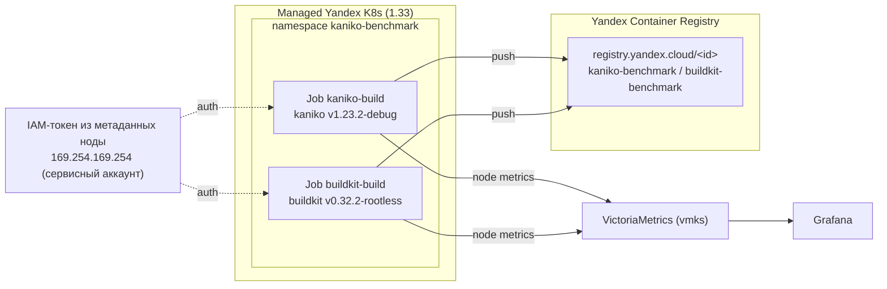

# Kaniko vs BuildKit в Managed Yandex K8s: что выбрать для сборки образов

## Введение

В Kubernetes-кластере рано или поздно встаёт вопрос: **где собирать Docker/OCI-образы приложений?** Вариант «на своей машине разработчика» не масштабируется на команду, а `docker build` прямо в поде невозможен — в контейнере нет демона Docker, а запускать privileged-контейнер с `/var/run/docker.sock` хотят не все (в managed-кластере это, как правило, и нельзя).

Классических ответов два — **Kaniko** и **BuildKit**:

- **Kaniko** (`gcr.io/kaniko-project/executor`) — инструмент от Google, который собирает образы **без privileged-контейнера**, запускаясь из обычного контейнера (внутри работает от root, но без привилегий ноды). Репозиторий [GoogleContainerTools/kaniko](https://github.com/GoogleContainerTools/kaniko) **архивирован владельцем 3 июня 2025 года** и доступен только для чтения — проект больше не развивается.
- **BuildKit** (`moby/buildkit`) — движок сборки, который с 2022 года стоит за `docker build` в десктопном Docker (через `buildx`). В Kubernetes запускается в **rootless-режиме** (UID 1000) и daemonless: один контейнер поднимает свой встроенный демон, собирает и пушит образ. Слава BuildKit — скорость (параллелизм по слоям, кэш, BuildKit-кэш-могут-переживать пересборки) и богатый синтаксис Dockerfile.

Этот репозиторий — **воспроизводимый бенчмарк** на Managed Yandex K8s: один и тот же multi-stage Dockerfile собирается обоими инструментами в одних и тех же условиях, с замером времени, потребления CPU/RAM и поведения кэша. Плюс — детальный разбор **преимуществ и недостатков** каждого подхода для продакшна.

## Что измеряем

| Категория | Как измеряем |
|---|---|
| **Время сборки** (без кэша / с кэшем) | `time-build.sh` замеряет `date +%s` до/после команды сборки внутри Job, пишет в `/artifacts/times.txt` |
| **Потребление CPU/RAM** | node-exporter + cAdvisor → VictoriaMetrics → дашборд Grafana «Kaniko vs BuildKit» |
| **Кэширование слоёв** | повторный запуск того же Dockerfile с включённым кэшем: kaniko `--cache` (registry-кэш) и BuildKit `--import-cache`/`--export-cache type=registry` (тоже registry-кэш) |
| **Особенности Managed Yandex K8s** | auth в Registry через IAM-токен из метаданных ноды, отсутствие потребности в privileged-контейнерах, daemonless-сборка без docker.sock |
| **Поддержка Dockerfile-синтаксиса** | один и тот же Dockerfile (apt, multi-stage, COPY --from) — сравнение совместимости |

## Архитектура стенда



Terraform поднимает:

- VPC + 3 приватные подсети (по одной в зонах `ru-central1-b/-d/-e`), NAT-шлюз с route table — ноды **без публичных IP** (согласно AGENTS.md);
- Managed K8s master 1.33 (regional, 3 зоны), node group из 3 preemptible нод `standard-v3` 4 vCPU / 8 ГБ;
- Traefik (ingress) для доступа к Grafana через `sslip.io`;
- **Yandex Container Registry** + IAM-привязку для сервисного аккаунта кластера (`container-registry.images.pusher` / `container-registry.images.puller`);
- VictoriaMetrics k8s-stack в namespace **`vmks`** (с отключёнными scrape и правилами для control-plane — как того требует AGENTS.md для Managed Yandex K8s). Устанавливается **отдельным шагом** через скрипт `install-vmks.sh` после `terraform apply` — terraform только рендерит `values/vmks-values.yaml`.

## Сравниваемые варианты

| Вариант | Образ | Запуск | Auth в registry |
|---|---|---|---|
| **Kaniko** | `gcr.io/kaniko-project/executor:v1.23.2-debug` | Job, обычный контейнер без privileged (root, но внутри) | IAM-токен из метаданных ноды → `config.json` в `/kaniko/.docker` |
| **BuildKit** | `moby/buildkit:v0.32.2-rootless` | Job, rootless-режим (UID 1000), daemonless (`buildctl-daemonless.sh`) | IAM-токен из метаданных ноды → `~/.docker/config.json` (UID 1000) |

Оба пушат в один и тот же Yandex Container Registry (`registry.yandex.cloud/<registry-id>/`).

## Развёртывание

### 1. Terraform

```bash
terraform init
terraform apply -auto-approve
```

После apply Terraform выводит:

- `k8s_cluster_credentials_command` — команда получения доступа к K8s;
- `grafana_url` + `grafana_admin_password_command` — доступ к дашборду;
- `registry_server` — адрес `registry.yandex.cloud/<id>`;
- `apply_benchmark_command` — команда применения манифестов бенчмарка.

> Terraform **не устанавливает** VictoriaMetrics k8s-stack (vmks): он только рендерит `values/vmks-values.yaml`. Сама установка — отдельным шагом ниже.

### 1a. Установка мониторинга (vmks)

```bash
./install-vmks.sh
```

Скрипт проверяет доступность кластера, наличие отрендеренного `values/vmks-values.yaml` (создаётся при `terraform apply`) и выполняет `helm upgrade --install` в namespace `vmks`. Идемпотентен — повторный запуск безопасен.

### 2. Доступ к кластеру

```bash
yc managed-kubernetes cluster get-credentials --id $(terraform output -raw k8s_cluster_id) --external --force
kubectl get nodes
```

### 3. Применить манифесты бенчмарка

```bash
kubectl apply -f benchmark/namespace.yaml \
  -f benchmark/scripts-configmap.yaml \
  -f benchmark/build-context-configmap.yaml \
  -f benchmark/kaniko/kaniko-job.yaml \
  -f benchmark/buildkit/buildkit-job.yaml
```

<details>
<summary>Что внутри манифестов</summary>

- `benchmark/namespace.yaml` — namespace `kaniko-benchmark`;
- `benchmark/scripts-configmap.yaml` — скрипты: замер времени (`time-build.sh`), получение IAM-токена и запись docker-config (никаких секретов в манифестах нет — токен живёт 12 часов и берётся из метаданных ноды прямо во время запуска);
- `benchmark/build-context-configmap.yaml` — общий для обоих инструментов multi-stage Dockerfile + исходники приложения (`app.py` — Flask-приложение);
- `benchmark/kaniko/kaniko-job.yaml` — Job `kaniko-build` (генерируется Terraform из `.tftpl`, с реальным `registry_id`);
- `benchmark/buildkit/buildkit-job.yaml` — Job `buildkit-build` (тоже генерируется, rootless-режим).
</details>

### 4. Запуск и наблюдение

Оба Job запускаются параллельно (каждый — отдельная нода за счёт тех же ресурсов). Следим:

```bash
kubectl -n kaniko-benchmark get jobs -w
kubectl -n kaniko-benchmark get pods -w
```

По завершении — сводка времени в `times.txt` каждого Job:

```bash
kubectl -n kaniko-benchmark logs job/kaniko-build
kubectl -n kaniko-benchmark logs job/buildkit-build
```

### 5. Дашборд в Grafana

Откройте дашборд **«Kaniko vs BuildKit — ресурсы во время сборки»** (`UID: kaniko-vs-buildkit`): CPU rate, memory working set и сетевой трафик каждого пода на время его сборки. Файл `dashboards/kaniko-vs-buildkit-dashboard.json` — импортируйте его в Grafana вручную (Grafana → Dashboards → Import → Upload JSON), либо применён через ConfigMap-подход автоматически (см. ниже).

## Ожидаемые результаты

Таблица заполняется после реального прогона (см. «Как заполнить результаты» ниже). Ожидания из практики:

| Метрика | Kaniko | BuildKit |
|---|---|---|
| Время сборки **без кэша** (полный `apt install` + pip) | ~3–5 мин | ~1.5–3 мин (параллельные шаги) |
| Время сборки **с кэшем** (повторный прогон) | быстрее через `--cache` (registry-кэш): слой берётся из registry без пересборки | registry-кэш через `--import-cache`/`--export-cache type=registry`, push только новых слоёв |
| CPU (max) | монотонно по слоям | многопоточный (несколько воркеров за раз) |
| RAM (max) | выше из-за полного `apt`/pip в процессе | зависит от параллелизма |
| Итоговый образ | OCI | OCI |

> Это **ожидания**, а не результат. Ниже методика, как получить числа на вашем стенде, и таблицы для заполнения.

## Как заполнить таблицу результатов

1. Выполните **первый прогон** (холодный кэш):
   ```bash
   kubectl -n kaniko-benchmark delete job kaniko-build buildkit-build --ignore-not-found
   kubectl apply -f benchmark/kaniko/kaniko-job.yaml -f benchmark/buildkit/buildkit-job.yaml
   kubectl -n kaniko-benchmark logs job/kaniko-build   # строка kaniko elapsed_sec=...
   kubectl -n kaniko-benchmark logs job/buildkit-build # строка buildkit elapsed_sec=...
   ```
2. Выполните **второй прогон** (тёплый кэш) тем же способом — запишите вторые числа.
3. Снимите CPU/RAM с дашборда Grafana за соответствующий интервал времени.
4. Внесите числа в таблицы ниже и сформулируйте вывод.

### Прогон 1: холодный кэш

| Метрика | Kaniko | BuildKit |
|---|---|---|
| Время сборки (сек) | _заполнить_ | _заполнить_ |
| Пиковый CPU (rate, cores) | _заполнить_ | _заполнить_ |
| Пиковая RAM (working set, GiB) | _заполнить_ | _заполнить_ |
| Ошибки/retries | _заполнить_ | _заполнить_ |

### Прогон 2: тёплый кэш

| Метрика | Kaniko | BuildKit |
|---|---|---|
| Время сборки (сек) | _заполнить_ | _заполнить_ |
| Пиковый CPU (rate, cores) | _заполнить_ | _заполнить_ |
| Пиковая RAM (working set, GiB) | _заполнить_ | _заполнить_ |
| Ошибки/retries | _заполнить_ | _заполнить_ |

## Преимущества и недостатки

### Kaniko

**Преимущества:**

- **Работает без привилегий.** Обычный контейнер без privileged, никакого docker.sock — подходит для managed-кластера и строгих политик безопасности.
- **Простота.** Один бинарник-джоб хорошо известен, огромное количество документации и примеров.
- **Кэш в registry.** `--cache-repo` позволяет переиспользовать слои между сборками непротиворечиво, даже если сам кластер/нода меняются (кэш живёт в registry, а не на диске пода).
- **Можно собирать в любом кластере** — без настройки daemon, без sysctl, без user-namespace.

**Недостатки:**

- **Скорость.** Сборка идёт последовательно по слоям (несколько слоёв параллельно не строятся), что на тяжёлых Dockerfile заметно медленнее BuildKit.
- **Слабое кэширование на диске.** По умолчанию кэш пишется в registry (медленнее и дороже), локального кэша между прогонами нет.
- **Ограниченный синтаксис.** Не поддерживает продвинутые фичи BuildKit: `RUN --mount=type=cache`, `RUN --mount=type=secret`, `--mount=type=ssh` и т.п. (часть поддерживается через флаги, но не вся).
- **Контекст и большие слои.** Kaniko должен скачивать и разворачивать базовый образ и предыдущие слои целиком; при большом контексте это занимает время и место.

### BuildKit

**Преимущества:**

- **Скорость.** Многопоточная сборка (параллельные шаги), кэш слоёв и быстрый инкрементальный пересбор. На реальных Dockerfile часто в 2–3 раза быстрее Kaniko.
- **Родная поддержка кэша.** `buildkitd` умеет хранить кэш локально и поддерживает внешние кэши (registry, S3). В этом бенчмарке локальный кэш не используется — BuildKit работает с registry-кэшем через `--import-cache`/`--export-cache type=registry` (аналог `--cache-repo` Kaniko).
- **Богатый синтаксис.** `RUN --mount=type=cache|secret|ssh`, `RUN --mount=type=bind`, BuildKit-составные шаги, возможность подключать внешние кэши.
- **Та же технология, что у `docker build`.** Что собирается в CI/local docker, то и BuildKit — единый синтаксис.

**Недостатки:**

- **Rootless-режим имеет нюансы.** Требует unprivileged user namespaces (на нодах может понадобиться `sysctl -w user.max_user_namespaces=63359`), `oci-worker-no-process-sandbox`, отключение seccomp/apparmor на уровне пода. В managed Yandex K8s это либо работает «из коробки», либо требует DaemonSet-воркараунд.
- **Сложнее.** Daemonless-джоб поднимает встроенный демон, требует понимания `buildctl`/`buildkitd` и кэша.
- **Ресурсы.** Многопоточность = большее пиковое потребление CPU/RAM, которое нужно учитывать в requests/limits.
- **Оба кэша эфемерны.** В этом бенчмарке ни Kaniko, ни BuildKit не хранят локальный кэш между прогонами (Kaniko не пишет кэш на диск по умолчанию, BuildKit живёт в daemonless-поде без PVC) — теплота кэша обеспечивается только registry-кэшем. Kaniko-кэш в `--cache-repo` и BuildKit-кэш в `--export-cache type=registry` в равной степени переживают пересоздание подов.

## Вывод

Kaniko — «заниженный порог входа» для безопасной сборки без привилегий (без privileged); подходит, когда нужно просто и надёжно собрать типовой образ в managed-кластере. BuildKit — значительный прирост скорости и выразительности Dockerfile ценой сложности rootless-настройки и большего потребления ресурсов.

Итоговую рекомендацию нужно давать по числам из таблиц выше: если сборка редкая и Dockerfile типовой, Kaniko достаточно; если собираете часто, образы тяжёлые и хочется скорости — BuildKit, но с правильной конфигурацией кэша и ресурсов.

## Файлы

| Файл | Назначение |
|------|-----------|
| `versions.tf`, `providers.tf`, `variables.tf`, `locals.tf` | Провайдеры и общие настройки Terraform |
| `net.tf` | VPC, 3 приватные подсети, NAT-шлюз, route table |
| `ip-dns.tf` | Публичный IP балансировщика Traefik |
| `k8s.tf` | Managed K8s (master 1.33, региональный), node group, Traefik |
| `registry.tf` | Yandex Container Registry + IAM-привязка для SA кластера |
| `monitoring.tf`, `values/vmks-values.yaml.tftpl` | Рендер values для VictoriaMetrics k8s-stack в namespace `vmks` (с отключёнными scrape control-plane); установка — через `install-vmks.sh` |
| `install-vmks.sh` | Установка vmks после `terraform apply` (`helm upgrade --install`, идемпотентно) |
| `benchmark.tf` | Рендер job-манифестов из `.tftpl` (registry_id) |
| `benchmark/namespace.yaml` | Namespace `kaniko-benchmark` |
| `benchmark/scripts-configmap.yaml` | Скрипты: замер времени, IAM-токен, docker-config |
| `benchmark/build-context-configmap.yaml` | Общий Dockerfile + исходники приложения |
| `benchmark/kaniko/kaniko-job.yaml.tftpl` | Job kaniko (генерируется: `benchmark/kaniko/kaniko-job.yaml`) |
| `benchmark/buildkit/buildkit-job.yaml.tftpl` | Job buildkit в rootless-режиме (генерируется) |
| `app/` | Исходники тестового приложения (Flask) |
| `dashboards/kaniko-vs-buildkit-dashboard.json` | Дашборд Grafana |

## Требования

- Yandex Cloud CLI (`yc`) с авторизацией, Terraform ≥ 1.3;
- `folder_id` в `terraform.tfvars`;
- `helm` v3 (для установки vmks через `install-vmks.sh`);
- (для прогона) кластер развёрнут `terraform apply`, установлен `kubectl`.