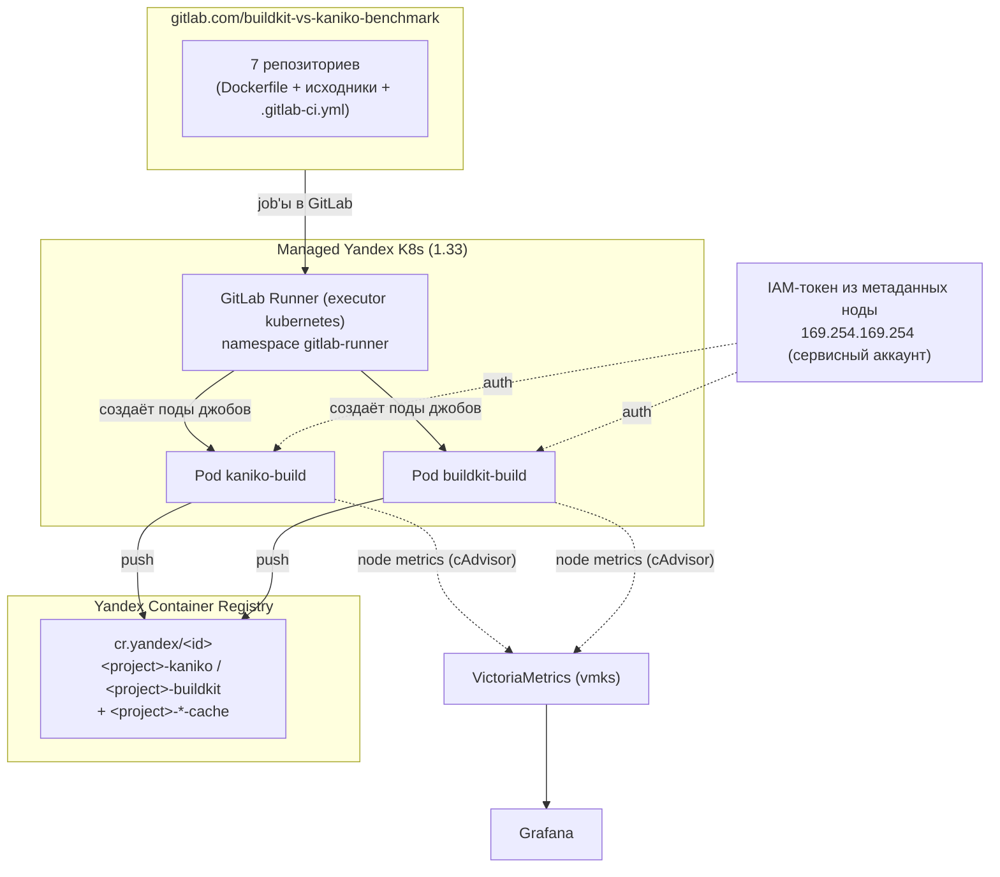

# Kaniko vs BuildKit в Managed Yandex K8s: что выбрать для сборки образов

## Введение

В Kubernetes-кластере рано или поздно встаёт вопрос: **где собирать Docker/OCI-образы приложений?** Вариант «на своей машине разработчика» не масштабируется на команду, а `docker build` прямо в поде невозможен — в контейнере нет демона Docker, а запускать privileged-контейнер с `/var/run/docker.sock` хотят не все (в managed-кластере это, как правило, и нельзя).

Ещё один классический способ — **отдельная виртуальная машина с установленным Docker**, на которой сборка запускается «как обычно» (тот же `docker build`), а готовый образ пушится в registry и дальше разворачивается в кластере. Такой ВМ нужен публичный/приватный сетевой доступ, её надо поддерживать (обновления, патчи, авторизация), а джобы сборки — направлять на неё через Docker Remote API/SSH/`docker context`. Это снимает ограничение managed-кластера (нельзя privileged + docker.sock), но переносит сборку «в сторону» — со своей инфраструктурой и накладными расходами. Минусы такого подхода:

- **Нет горизонтального масштабирования.** ВМ не растёт под нагрузку — в отличие от K8s, который масштабируется cluster autoscaler'ом и добавляет ноды под новые поды.
- **Параллельные job делят ресурсы.** Несколько job запустить можно, но они конкурируют за CPU/RAM/диск одной ВМ.
- **Нужно чистить диск.** Кэш сборки накапливается на диске ВМ и периодически требует ручной очистки.

Классических ответов два — **Kaniko** и **BuildKit**:

- **Kaniko** (`gcr.io/kaniko-project/executor`) — инструмент от Google, который собирает образы **без privileged-контейнера**, запускаясь из обычного контейнера (внутри работает от root, но без привилегий ноды). Репозиторий [GoogleContainerTools/kaniko](https://github.com/GoogleContainerTools/kaniko) **архивирован владельцем 3 июня 2025 года** и доступен только для чтения — проект больше не развивается.
- **BuildKit** (`moby/buildkit`) — движок сборки, который с 2022 года стоит за `docker build` в десктопном Docker (через `buildx`). В Kubernetes запускается **daemonless**: один контейнер поднимает свой встроенный демон `buildkitd`, собирает и пушит образ. В этом бенчмарке демон работает в **rootless-режиме** (`moby/buildkit:v0.32.2-rootless`) — без privileged, как и Kaniko; для этого build-контейнеру нужен ослабленный seccomp/apparmor (`Unconfined`), а нодам — unprivileged user namespaces.

Этот репозиторий — **воспроизводимый бенчмарк** на Managed Yandex K8s: **7 проектов** разных языков и фреймворков собираются обоими инструментами в одних и тех же условиях, с замером времени, потребления CPU/RAM и поведения кэша. В конце — **итоговая сводная таблица** и разбор **преимуществ и недостатков** каждого подхода для продакшна.

## Концепция

В отличие от старого варианта (Kubernetes Job вручную), теперь сборка запускается **GitLab CI**:

- **7 проектов** — отдельные репозитории группы [gitlab.com/buildkit-vs-kaniko-benchmark](https://gitlab.com/buildkit-vs-kaniko-benchmark). В корне каждого лежат Dockerfile и исходники (контекст сборки).
- Каждый репозиторий содержит `.gitlab-ci.yml` с **двумя параллельными job'ами** — `kaniko-build` и `buildkit-build`.
- Сборки выполняет **GitLab Runner (executor kubernetes)**, развёрнутый в этом же кластере (helm-чарт, каталог `gitlab-runner/`).
- Результаты собираются в **Grafana**: дашборд с двумя графиками — **BuildKit** и **Kaniko** (CPU/RAM build-контейнера за время сборки).

## Что измеряем

| Категория | Как измеряем |
|---|---|
| **Время сборки** | длительность job'а `kaniko-build` / `buildkit-build` в GitLab (страница пайплайна или API) |
| **Потребление CPU/RAM** | cAdvisor → VictoriaMetrics → дашборд Grafana «Kaniko vs BuildKit — GitLab Runner» |
| **Кэширование слоёв** | повторный запуск того же Dockerfile с включённым кэшем: kaniko `--cache` (registry-кэш) и BuildKit `--import-cache`/`--export-cache type=registry` (тоже registry-кэш) |
| **Особенности Managed Yandex K8s** | auth в Registry через IAM-токен из метаданных ноды, отсутствие потребности в privileged-контейнерах, daemonless-сборка без docker.sock |
| **Поддержка Dockerfile-синтаксиса** | одинаковые Dockerfile (apt, multi-stage, COPY --from) — сравнение совместимости |

## Сравниваемые проекты

Бенчмарк собирает **7 проектов** — по одному на характерный «профиль сборки»:

| № | Проект | Язык/Framework | Профиль сборки | Репозиторий |
|---|---|---|---|---|
| 1 | **Flask + Gunicorn** | Python | `pip install` multi-stage | [`flask`](https://gitlab.com/buildkit-vs-kaniko-benchmark/flask) |
| 2 | **NestJS** | Node/TS | тяжёлый `npm ci` + декораторы, tsc | [`nestjs`](https://gitlab.com/buildkit-vs-kaniko-benchmark/nestjs) |
| 3 | **Next.js** | Node/React SSR | `npm ci` + сборка клиента | [`nextjs`](https://gitlab.com/buildkit-vs-kaniko-benchmark/nextjs) |
| 4 | **Nuxt 3** | Node/Vue SSR | `npm ci` + сборка клиента | [`nuxtjs`](https://gitlab.com/buildkit-vs-kaniko-benchmark/nuxtjs) |
| 5 | **Go HTTP-сервис** | Go | `go build` → статический бинарник (из scratch) | [`golang`](https://gitlab.com/buildkit-vs-kaniko-benchmark/golang) |
| 6 | **Android APK** | Java/Kotlin, Gradle | `assembleRelease`, тяжёлый Gradle/SDK | [`android`](https://gitlab.com/buildkit-vs-kaniko-benchmark/android) |
| 7 | **ML: PyTorch inference** | Python | `pip install torch` + скачивание ~1.3 ГБ весов в BUILD-стадии (public S3-бакет) | [`ml-pytorch`](https://gitlab.com/buildkit-vs-kaniko-benchmark/ml-pytorch) |

## Архитектура стенда



Terraform поднимает:

- VPC + 3 приватные подсети (по одной в зонах `ru-central1-b/-d/-e`), NAT-шлюз с route table — ноды **без публичных IP** (согласно AGENTS.md);
- Managed K8s master 1.33 (regional, 3 зоны), node group из 6 preemptible нод `standard-v3` 8 vCPU / 16 ГБ (по 2 ноды на зону);
- Traefik (ingress) для доступа к Grafana через `sslip.io`;
- **Yandex Container Registry** + IAM-привязку для сервисного аккаунта кластера (`container-registry.images.pusher` / `container-registry.images.puller`);
- VictoriaMetrics k8s-stack в namespace **`vmks`** (с отключёнными scrape и правилами для control-plane — как того требует AGENTS.md для Managed Yandex K8s). Устанавливается **отдельным шагом** через `helm` после `terraform apply` — terraform только рендерит `values/vmks-values.yaml`.

**GitLab Runner** устанавливается отдельно командой `helm` (helm-чарт, executor kubernetes) — terraform его не ставит.

## Сравниваемые варианты

| Вариант | Образ | Запуск | Auth в registry |
|---|---|---|---|
| **ВМ с Docker** | — (отдельная виртуальная машина, не контейнер в поде) | `docker build` на ВМ (Docker daemon на ноде), джоб CI направляется через SSH / `docker context` / Docker Remote API | обычный `docker login` (или `config.json`/credentials на ВМ) |
| **Kaniko** | `gcr.io/kaniko-project/executor:v1.23.2-debug` | Job GitLab CI (под раннера, обычный контейнер без privileged, root внутри) | IAM-токен из метаданных ноды → `config.json` в `/kaniko/.docker` |
| **BuildKit** | `moby/buildkit:v0.32.2-rootless` | Job GitLab CI, **daemonless** (`buildctl-daemonless.sh`), демон `buildkitd` rootless (`--oci-worker-no-process-sandbox`) | IAM-токен из метаданных ноды → `config.json` в `~/.docker` |

Оба пушат в один и тот же Yandex Container Registry (`cr.yandex/<registry-id>/`), по своему репозиторию на проект (`<project>-kaniko`, `<project>-buildkit`). Оба инструмента работают **без privileged** и **daemonless** — условия замеров уравнены, разница — только в самом инструменте сборки.

## Развёртывание

### 1. Terraform

```bash
terraform init
terraform apply -auto-approve
```

После apply Terraform выводит:

- `k8s_cluster_credentials_command` — команда получения доступа к K8s;
- `grafana_url` + `grafana_admin_password_command` — доступ к дашборду;
- `registry_id` — id Yandex Container Registry (для переменной `YCR_REGISTRY_ID` в GitLab CI);
- `ml_weights_url` — URL весов ML-модели (бакет `kaniko-vs-buildkit-weights`).

> Бакет `kaniko-vs-buildkit-weights` создаётся **Terraform'ом** (`weights.tf`, public-read).
> Файл весов заливается **один раз вручную** — генерировать 1.3 ГБ на каждый
> `terraform apply` нельзя. Без залитых весов джоб `ml-pytorch` упадёт на скачивании.

#### Какой файл

Модель `google-bert/bert-large-uncased` → файл `pytorch_model.bin` (**~1.28 ГБ**):

- Source (Hugging Face): `https://huggingface.co/google-bert/bert-large-uncased/resolve/main/pytorch_model.bin`
- В бакет кладётся под ключом `model.bin`
- URL для BUILD-стадии: `https://storage.yandexcloud.net/kaniko-vs-buildkit-weights/model.bin` (выводит `terraform output -raw ml_weights_url`)

#### Как залить (одним из способов)

Требуется: Yandex Cloud CLI, авторизация, статические ключи доступа для Object Storage
(создать через `yc iam access-key create --service-account-name ...` или в консоли).

**Вариант A — `mc` (MinIO Client):**

```bash
MC_HOST_s3=https://<access_key>:<secret_key>@storage.yandexcloud.net
mc cp pytorch_model.bin s3/kaniko-vs-buildkit-weights/model.bin
```

**Вариант B — AWS CLI (S3-совместимый API):**

```bash
AWS_ACCESS_KEY_ID=<access_key> \
AWS_SECRET_ACCESS_KEY=<secret_key> \
aws --endpoint-url=https://storage.yandexcloud.net \
  s3 cp pytorch_model.bin s3://kaniko-vs-buildkit-weights/model.bin
```

**Вариант C — `yc storage` + curl (без доп. клиентов):**

```bash
# 1. Скачать модель с HF
curl -fSL -o model.bin https://huggingface.co/google-bert/bert-large-uncased/resolve/main/pytorch_model.bin
# 2. Залить S3-совместимым клиентом (mc/aws) — без этих утилит Yandex CLI
#    не умеет грузить объекты, см. варианты A/B.
```

#### Проверка

```bash
curl -sI https://storage.yandexcloud.net/kaniko-vs-buildkit-weights/model.bin \
  | grep -iE "HTTP|content-length"
# ожидаем 200 и content-length ~1344997306
```

> Terraform **не устанавливает** VictoriaMetrics k8s-stack (vmks) и GitLab Runner — он только рендерит `values/vmks-values.yaml`. Установка — отдельными шагами ниже.

### 1a. Установка мониторинга (vmks)

```bash
helm repo add victoriametrics https://victoriametrics.github.io/helm-charts/
helm repo update
helm upgrade --install vmks victoriametrics/victoria-metrics-k8s-stack \
  --version 0.91.2 \
  --namespace vmks \
  --create-namespace \
  --values values/vmks-values.yaml \
  --timeout 15m
```

Перед установкой убедитесь, что кластер доступен (`kubectl get nodes`) и
отрендерен `values/vmks-values.yaml` (создаётся при `terraform apply`).
`helm upgrade --install` идемпотентен — повторный запуск безопасен.

### 1b. Установка GitLab Runner

```bash
helm repo add gitlab-runner https://charts.gitlab.io/
helm repo update
helm upgrade --install gitlab-runner gitlab-runner/gitlab-runner \
  --version 0.92.1 \
  --namespace gitlab-runner \
  --create-namespace \
  --values gitlab-runner/values.yaml \
  --set-string "runnerToken=<runner-token>" \
  --timeout 10m
```

`<runner-token>` — токен раннера: взять в группе
`gitlab.com/buildkit-vs-kaniko-benchmark` → **Build → Runners → New group runner**
(или Settings → CI/CD → Runners). Токен в репозиторий не коммитится.

Команда ставит helm-чарт `gitlab-runner` (executor kubernetes) в namespace
`gitlab-runner`. Конфигурация — в `gitlab-runner/values.yaml`. Подробнее —
`gitlab-runner/README.md`.

### 2. Настройка переменных GitLab CI

В группе `gitlab.com/buildkit-vs-kaniko-benchmark` → **Settings → CI/CD →
Variables** задать:

| Переменная | Значение |
|---|---|
| `YCR_REGISTRY_ID` | `terraform output -raw registry_id` (id registry, `cr...`) |

Переменная `YCR_REGISTRY` (адрес registry) задана по умолчанию в `.gitlab-ci.yml`
как `cr.yandex` — её можно переопределить при необходимости.

Секретов хранить не нужно: auth выполняется IAM-токеном из метаданных ноды.

### 3. Перенос проектов в репозитории

Каждый из 7 проектов — отдельный репозиторий группы. Содержимое (Dockerfile +
исходники + `.gitlab-ci.yml`) кладётся в корень main-ветки соответствующего
репозитория. Имена репозиториев: `android`, `flask`, `golang`, `ml-pytorch`,
`nestjs`, `nextjs`, `nuxtjs`.

Эталонный `.gitlab-ci.yml` (одинаков для всех 7 проектов; `$CI_PROJECT_NAME`
автоматически подставляет имя репозитория):

```yaml
variables:
  # cr.yandex — верный хост Yandex Container Registry
  # (registry.yandex.cloud не существует в DNS).
  YCR_REGISTRY: cr.yandex

stages:
  - build

before_script: &docker-auth
  # Короткоживущий IAM-токен из метаданных ноды -> docker config для push/pull.
  - mkdir -p "$DOCKER_CONFIG"
  - TOKEN=$(wget -q -O - --header="Metadata-Flavor: Google" "http://169.254.169.254/computeMetadata/v1/instance/service-accounts/default/token" | sed -n 's/.*"access_token":"\([^"]*\)".*/\1/p')
  - AUTH_B64=$(printf 'iam:%s' "$TOKEN" | base64 | tr -d '\n')
  - printf '{"auths":{"%s":{"auth":"%s"}}}' "$YCR_REGISTRY" "$AUTH_B64" > "$DOCKER_CONFIG/config.json"

kaniko-build:
  stage: build
  image: gcr.io/kaniko-project/executor:v1.23.2-debug
  variables:
    DOCKER_CONFIG: /kaniko/.docker
  script:
    - /kaniko/executor
        --dockerfile=Dockerfile
        --context=dir://$CI_PROJECT_DIR
        --destination="$YCR_REGISTRY/$YCR_REGISTRY_ID/$CI_PROJECT_NAME-kaniko:latest"
        --cache=true
        --cache-repo="$YCR_REGISTRY/$YCR_REGISTRY_ID/$CI_PROJECT_NAME-kaniko-cache"

buildkit-build:
  stage: build
  image: moby/buildkit:v0.32.2-rootless
  variables:
    DOCKER_CONFIG: /home/user/.docker
    XDG_RUNTIME_DIR: /tmp/buildkit
    BUILDKITD_FLAGS: --oci-worker-no-process-sandbox
  script:
    - buildctl-daemonless.sh build
        --frontend dockerfile.v0
        --local "context=$CI_PROJECT_DIR"
        --local "dockerfile=$CI_PROJECT_DIR"
        --output "type=image,name=$YCR_REGISTRY/$YCR_REGISTRY_ID/$CI_PROJECT_NAME-buildkit:latest,push=true"
        --import-cache "type=registry,ref=$YCR_REGISTRY/$YCR_REGISTRY_ID/$CI_PROJECT_NAME-buildkit-cache"
        --export-cache "type=registry,ref=$YCR_REGISTRY/$YCR_REGISTRY_ID/$CI_PROJECT_NAME-buildkit-cache,mode=max"
```

Ослабленный securityContext для rootless BuildKit (`seccompProfile: Unconfined`,
`appArmorProfile: Unconfined`) задаётся на уровне раннера в
`gitlab-runner/values.yaml` (`build_container_security_context`) — в
`.gitlab-ci.yml` его прописывать не нужно.

### 4. Запуск прогона

Запустите пайплайн в любом репозитории (Push → Pipeline). Пара
`kaniko+buildkit` выполняется параллельно. Между проектами — независимые
пайплайны (можно запускать все 7 параллельно).

Длительность сборки каждого инструмента — это длительность соответствующего
job'а в GitLab (страница пайплайна или GitLab API).

### 5. Дашборд в Grafana

Откройте дашборд **«Kaniko vs BuildKit — GitLab Runner»**
(`UID: kaniko-vs-buildkit-gitlab`): два графика — **BuildKit** и **Kaniko**
(CPU rate и memory working set build-контейнера за время сборки). Файл
`dashboards/kaniko-vs-buildkit-gitlab-runner.json` — импортируйте его в Grafana
вручную (Grafana → Dashboards → Import → Upload JSON), либо применяется
через ConfigMap-подход автоматически (см. `dashboards/README.md`).

## Ожидаемые результаты

Таблица заполняется после реального прогона (см. «Как заполнить результаты» ниже). Ожидания из практики:

| Метрика | Kaniko | BuildKit |
|---|---|---|
| Время сборки **без кэша** (полный `apt install` + pip) | ~3–5 мин | ~1.5–3 мин (параллельные шаги) |
| Время сборки **с кэшем** (повторный прогон) | быстрее через `--cache` (registry-кэш): слой берётся из registry без пересборки | registry-кэш через `--import-cache`/`--export-cache type=registry`, push только новых слоёв |
| CPU (max) | монотонно по слоям | многопоточный (несколько воркеров за раз) |
| RAM (max) | выше из-за полного `apt`/pip в процессе | зависит от параллелизма |
| Итоговый образ | OCI | OCI |

> Это **ожидания**, а не результат. Ниже методика, как получить числа на вашем стенде, и таблицы для заполнения.

## Как заполнить сводную таблицу результатов

1. Запустите пайплайн в каждом из 7 репозиториев (первый прогон — холодный кэш).
2. Зафиксируйте длительность job'ов `kaniko-build` и `buildkit-build` (страница
   пайплайна в GitLab или API `GET /projects/:id/pipelines/:pipeline_id/jobs`).
3. Запустите повторный прогон (тёплый кэш) тем же способом — запишите вторые числа.
4. Снимите CPU/RAM с дашборда Grafana за соответствующий интервал.
5. Внесите числа в таблицу ниже и сформулируйте вывод.

### Итоговая сводная таблица (7 проектов)

Заполняется после реального прогона. Пример формата:

| Проект | Время kaniko (с) | Время buildkit (с) | Выигрыш BuildKit % |
|---|---|---|---|
| flask | _заполнить_ | _заполнить_ | _заполнить_ |
| nestjs | _заполнить_ | _заполнить_ | _заполнить_ |
| nextjs | _заполнить_ | _заполнить_ | _заполнить_ |
| nuxtjs | _заполнить_ | _заполнить_ | _заполнить_ |
| golang | _заполнить_ | _заполнить_ | _заполнить_ |
| android | _заполнить_ | _заполнить_ | _заполнить_ |
| ml-pytorch | _заполнить_ | _заполнить_ | _заполнить_ |

### Детализация по метрикам (пример на проекте golang)

#### Прогон 1: холодный кэш

| Метрика | Kaniko | BuildKit |
|---|---|---|
| Время сборки (сек) | _заполнить_ | _заполнить_ |
| Пиковый CPU (rate, cores) | _заполнить_ | _заполнить_ |
| Пиковая RAM (working set, GiB) | _заполнить_ | _заполнить_ |
| Ошибки/retries | _заполнить_ | _заполнить_ |

#### Прогон 2: тёплый кэш

| Метрика | Kaniko | BuildKit |
|---|---|---|
| Время сборки (сек) | _заполнить_ | _заполнить_ |
| Пиковый CPU (rate, cores) | _заполнить_ | _заполнить_ |
| Пиковая RAM (working set, GiB) | _заполнить_ | _заполнить_ |
| Ошибки/retries | _заполнить_ | _заполнить_ |

## Преимущества и недостатки

### ВМ с Docker

**Преимущества:**

- **Полноценный `docker build`.** Никаких ограничений managed-кластера: доступен privileged, демон Docker, `docker buildx`, любые флаги и синтаксис.
- **Накопление кэша.** Слои и кэш сборки живут на диске ВМ между прогонами — инкрементальные пересборки максимально быстрые.
- **Просто для команд с legacy.** Если сборка уже «работает на сервере с Docker», перенос на ВМ ничего не ломает.

**Недостатки:**

- **Отдельная инфраструктура.** ВМ нужно создавать, настраивать, обновлять и патчить; появляется ещё один компонент, который надо мониторить и бэкапить.
- **Безопасность и сеть.** ВМ должна быть доступна CI-джобам (публичный IP или приватная сеть + NAT), а `docker.sock`/Docker Remote API — источник эскалации до root на ноде; требует защиты (TLS, аутентификация, ограничение доступа).
- **Масштабируемость.** Одна ВМ с Docker — узкое место: параллельные сборки делят её CPU/RAM/диск, горизонтально масштабировать сложнее, чем поды в кластере.
- **Сборка «в стороне» от кластера.** Образ всё равно пушится в registry и заливается в K8s — появляется лишний hop и задержка.

### Kaniko

**Преимущества:**

- **Работает без привилегий.** Обычный контейнер без privileged, никакого docker.sock — подходит для managed-кластера и строгих политик безопасности.
- **Простота.** Один бинарник-джоб хорошо известен, огромное количество документации и примеров.
- **Кэш в registry.** `--cache-repo` позволяет переиспользовать слои между сборками непротиворечиво, даже если сам кластер/нода меняются (кэш живёт в registry, а не на диске пода).
- **Можно собирать в любом кластере** — без настройки daemon, без sysctl, без user-namespace.

**Недостатки:**

- **Скорость.** Сборка идёт последовательно по слоям (несколько слоёв параллельно не строятся), что на тяжёлых Dockerfile заметно медленнее BuildKit.
- **Слабое кэширование на диске.** По умолчанию кэш пишется в registry (медленнее и дороже), локального кэша между прогонами нет.
- **Ограниченный синтаксис.** Не поддерживает продвинутые фичи BuildKit: `RUN --mount=type=cache`, `RUN --mount=type=secret`, `--mount=type=ssh` и т.п. (часть поддерживается через флаги, но не вся).
- **Контекст и большие слои.** Kaniko должен скачивать и разворачивать базовый образ и предыдущие слои целиком; при большом контексте это занимает время и место.

### BuildKit

**Преимущества:**

- **Скорость.** Многопоточная сборка (параллельные шаги), кэш слоёв и быстрый инкрементальный пересбор. На реальных Dockerfile часто в 2–3 раза быстрее Kaniko.
- **Родная поддержка кэша.** `buildkitd` умеет хранить кэш локально и поддерживает внешние кэши (registry, S3). В этом бенчмарке локальный кэш не используется — BuildKit работает с registry-кэшем через `--import-cache`/`--export-cache type=registry` (аналог `--cache-repo` Kaniko).
- **Богатый синтаксис.** `RUN --mount=type=cache|secret|ssh`, `RUN --mount=type=bind`, BuildKit-составные шаги, возможность подключать внешние кэши.
- **Та же технология, что у `docker build`.** Что собирается в CI/local docker, то и BuildKit — единый синтаксис.

**Недостатки:**

- **Сложнее.** Daemonless-джоб поднимает встроенный демон, требует понимания `buildctl`/`buildkitd` и кэша.
- **Ресурсы.** Многопоточность = большее пиковое потребление CPU/RAM, которое нужно учитывать в requests/limits.
- **Оба кэша эфемерны.** В этом бенчмарке ни Kaniko, ни BuildKit не хранят локальный кэш между прогонами (Kaniko не пишет кэш на диск по умолчанию, BuildKit живёт в daemonless-поде без PVC) — теплота кэша обеспечивается только registry-кэшем. Kaniko-кэш в `--cache-repo` и BuildKit-кэш в `--export-cache type=registry` в равной степени переживают пересоздание подов.
- **Rootless-режим имеет нюансы.** В этом бенчмарке BuildKit работает rootless (как и Kaniko — без privileged), поэтому нужны unprivileged user namespaces на нодах, `oci-worker-no-process-sandbox` и ослабленный seccomp/apparmor (`Unconfined`) на build-контейнере. Если ноды не дают user namespaces — см. DaemonSet-воркараунд из `examples/kubernetes/sysctl-userns.privileged.yaml` в moby/buildkit.

## Вывод

Kaniko — «заниженный порог входа» для безопасной сборки без привилегий (без privileged); подходит, когда нужно просто и надёжно собрать типовой образ в managed-кластере. BuildKit — значительный прирост скорости и выразительности Dockerfile ценой сложности daemonless-настройки и большего потребления ресурсов. В этом бенчмарке оба инструмента работают **без privileged** в одинаковых условиях, поэтому разница сводится к скорости и кэшированию.

Итоговую рекомендацию нужно давать по числам из сводной таблицы: если сборка редкая и Dockerfile типовой, Kaniko достаточно; если собираете часто, образы тяжёлые (Node/Gradle/ML) и хочется скорости — BuildKit, но с правильной конфигурацией кэша и ресурсов.

## Файлы

| Файл | Назначение |
|------|-----------|
| `versions.tf`, `providers.tf`, `variables.tf`, `locals.tf` | Провайдеры и общие настройки Terraform |
| `net.tf` | VPC, 3 приватные подсети, NAT-шлюз, route table |
| `ip-dns.tf` | Публичный IP балансировщика Traefik |
| `k8s.tf` | Managed K8s (master 1.33, региональный), node group 6×8 vCPU/16 ГБ, Traefik |
| `registry.tf` | Yandex Container Registry + IAM-привязка для SA кластера, outputs `registry_id`/`registry_server` |
| `weights.tf` | S3-бакет `kaniko-vs-buildkit-weights` (public-read) для весов ML-проекта, вывод `ml_weights_url` |
| `monitoring.tf`, `values/vmks-values.yaml.tftpl` | Рендер values для VictoriaMetrics k8s-stack в namespace `vmks` (с отключёнными scrape control-plane); установка — через `helm` (см. раздел 1a) |
| `gitlab-runner/values.yaml` | Values helm-чарта GitLab Runner (executor kubernetes, лимиты build-контейнера) |
| `gitlab-runner/README.md` | Инструкция по установке и настройке GitLab Runner (командой `helm`, токен — через `--set-string`) |
| `dashboards/kaniko-vs-buildkit-gitlab-runner.json` | Дашборд Grafana: 2 графика (BuildKit и Kaniko) |
| `dashboards/README.md` | Как импортировать дашборд |
| `TODO.md` | Как залить веса ML-модели (~1.3 ГБ) в S3-бакет |

Репозитории проектов (в группе `gitlab.com/buildkit-vs-kaniko-benchmark`) содержат
`.gitlab-ci.yml` с двумя job'ами — `kaniko-build` и `buildkit-build`.

## Требования

- Yandex Cloud CLI (`yc`) с авторизацией, Terraform ≥ 1.3;
- `folder_id` в `terraform.tfvars`;
- `helm` v3 (для установки vmks и gitlab-runner);
- (для прогона) кластер развёрнут `terraform apply`, установлен `kubectl`, развёрнут GitLab Runner.
